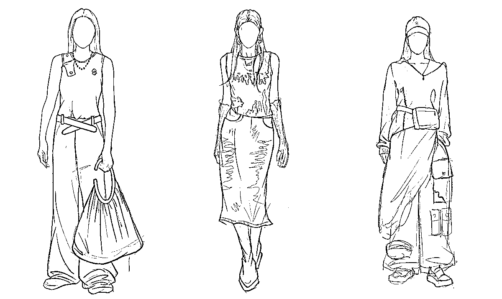

# ChatGPT 大浪潮下，AIGC 已经开始改造时尚行业了

> 原文：[`www.yuque.com/for_lazy/xkrm14/mu9pe2nav0p9g7hi`](https://www.yuque.com/for_lazy/xkrm14/mu9pe2nav0p9g7hi)

作者： 🐵Sunday🐵

日期：2023-04-30

点赞数：22

正文：

ChatGPT 大浪潮下，AIGC 已经开始改造时尚行业了 什么样的企业可以让时尚行业 AIGC 落地？从实现层面上来说，服务时尚数字化的头部企业，具有专业的场景理解，良好的数据底层，持续的模型研发能力，就具备让时尚行业 AIGC 落地的能力。我们手头上看到一家国内头部专注于服装行业数字化，并且刚刚发布了基于 AIGC 应用的企业 —— 凌迪 Style3D。从官方资料看，Style3D 是全球头部的专注于服务服装行业的 3D 数字化解决方案提供商。是一家服务服装行业全链条，包括面料商、辅料商、设计生产商，到品牌商数字化的企业，目前已经积累了大量的结构化数据。AIGC 的涌现能力强依赖于大量结构化的数据支撑，当前市面上的 AI 模型虽然能够实现多场景多领域的应用效果，但对于垂直的时尚行业并不是最优方案。究其原因，一方面是数据专业性，一方面是模型收敛域。 原文直达： [ChatGPT 大浪潮下，AIGC 已经开始改造时尚行业了](https://mp.weixin.qq.com/s/SmKQLFqg6PL69KrdIypVCw)

  

  

评论区：

