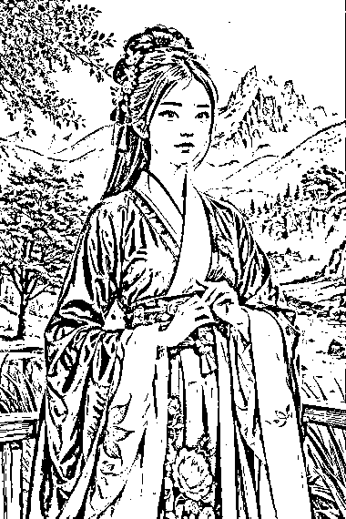

# 给小说配 Ai 图 ，老板要了 500 张+

> 原文：[`www.yuque.com/for_lazy/xkrm14/armgssodbwzcaka0`](https://www.yuque.com/for_lazy/xkrm14/armgssodbwzcaka0)

作者： 蕃茄

日期：2023-04-26

点赞数：76

正文：

收的 Ai 绘画订金 给小说配 Ai 图 发几张作废的 几块钱不等一张 老板要了 500 张+

  

  

  

评论区：

红日 : 你这是用哪个 AI 画的？ 关键词怎么配置的，能学习一下吗

蕃茄 : stable diffusion 商用的 参数比较多 你留个微信 我加你发给你

亿白—深圳—终身学习 : 我也想要可以吗 v:hwh050108

金九渊 : 怎么找到这种老板呢？

蕃茄 : 老板自己找的我

liong : 求参数 这几天再研究 sd 谢谢。我的号：invquant

梦忘忧 : 我也想要 stable diffusion 商用的 参数，能发下吗？

