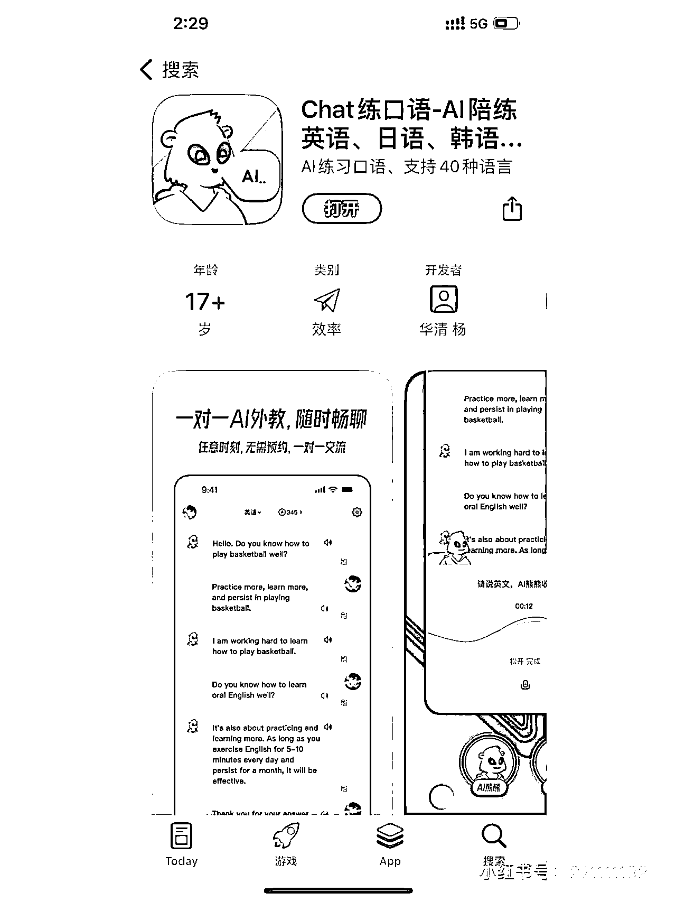

# 程序员开发“用 ChatGPT 练习口语”的软件，目前测试中

> 原文：[`www.yuque.com/for_lazy/xkrm14/dwwo7ctnw0d3oq9v`](https://www.yuque.com/for_lazy/xkrm14/dwwo7ctnw0d3oq9v)

作者： Aron.Li

日期：2023-04-25

点赞数：42

正文：

在小红书看到一位程序员开发的用 ChatGPT 练习口语的软件，目前测试中，后续需要充值做会员。 体检了下，目前功能比较简单，支持各国语音对话。 变现方式：充值会员+和有相关课程的老师合作。 适合人群：程序员（快就是机会）、拥有教育资源的朋友。 拓展下：这个 app 是练海外口语，那是不是国外的朋友也可以开发一款练汉语[奸笑]

评论区：

Aron.Li : 谢谢亦仁大大

