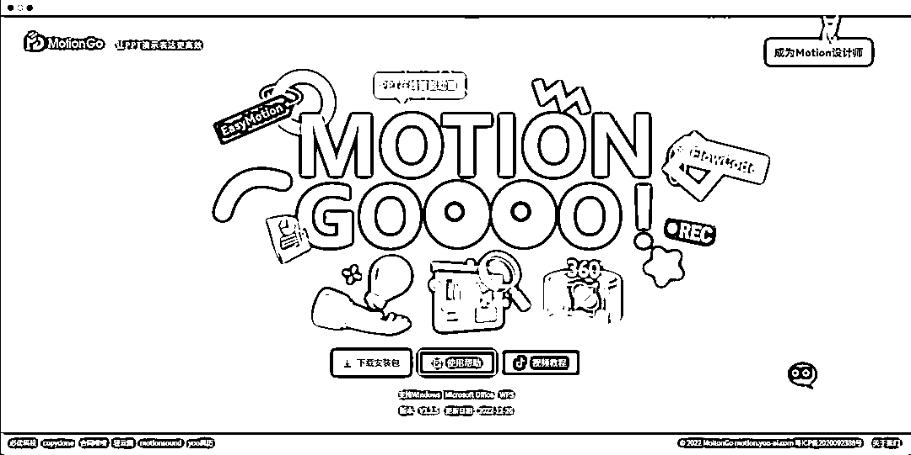
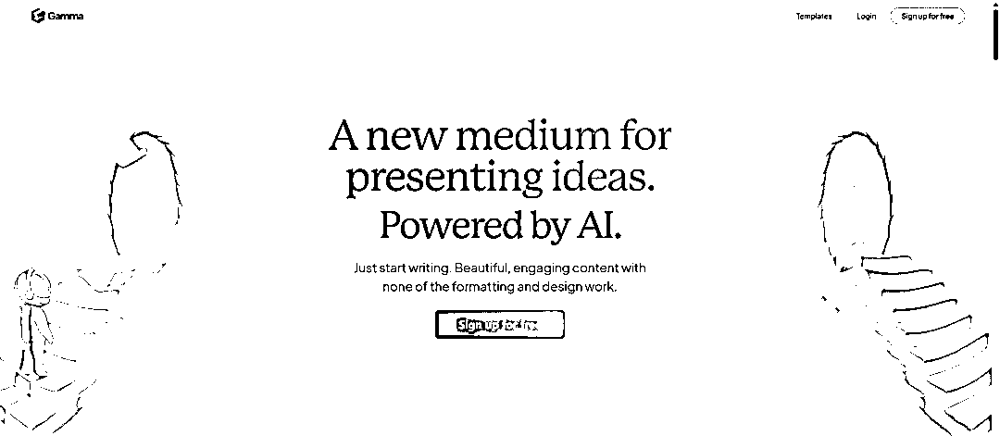

# 一键生成 PPT 到底哪家强？给大家总结了三种目前体验最好的方法

> 原文：[`www.yuque.com/for_lazy/xkrm14/wzpgqxzdpzoa36p3`](https://www.yuque.com/for_lazy/xkrm14/wzpgqxzdpzoa36p3)

作者： Vergil

日期：2023-04-25

点赞数：52

正文：

一键生成 PPT 到底哪家强？ 经过这段时间的摸索和体验，给大家总结了三种目前体验最好的方法，各有利弊： 1、M‍‍otion Go 点评：整体体验上，还是比较方便的，几乎没有门槛，虽然说输出成品水平一般，但是时间紧急的话也够用。 02、Gamma 点评：模板质量高，生成速度快，不需要安装就能直接使用，无需付费（可能是暂时），调整版式布局比较方便，支持对话式修改，不过需要有一定的英文基础（也可以借助翻译），文件导出暂不支持 PPT 文件，需要额外使用 PDF 转码器进行转码。 3、闪击 PPT 点评：总体来说，闪击 PPT 的使用是需要一定的门槛，主要依托 ChatGPT 的内容扩写 只有内容上和 AI 相关，其余修改仍然需要手动，中间模块化的设置自定义程度高，本身内置的模板质量比较简约，风格相对单一，目前导出可编辑文件需要付费。 总结：三者对比之后，体验感最好的是 Motion Go，模板质量最高的是 Gamma，制作效率最快的是闪击 PPT。大家可以根据自己的实际需求使用。 [MotionGo 官网原 PPT 动画插件口袋动画免费商用 PPT 插件](http://motion.yoo-ai.com/) [Gamma+App](https://gamma.app/) [闪击 PPT+-+高效内容演示](https://ppt.sankki.com/)

评论区：

老彭 : 好用吗，我先把我写的文章，一键转成 PPT，给团队开会

Vergil : 推荐 MOTION GO

伊晨 : 感谢分享

