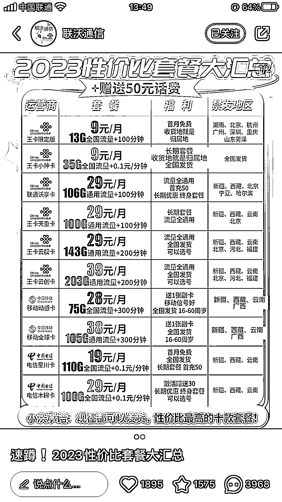
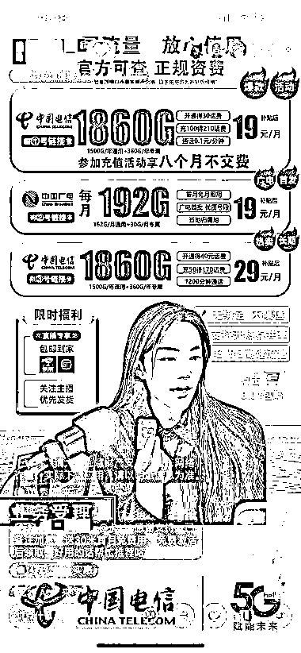

# 小红书、抖音卖大流量电话卡

> 原文：[`www.yuque.com/for_lazy/xkrm14/sbts3rs9bpgnoqiq`](https://www.yuque.com/for_lazy/xkrm14/sbts3rs9bpgnoqiq)

作者： 随想

日期：2023-05-03

点赞数：71

正文：

小红书、抖音卖大流量电话卡 推荐理由： 1.长久可以做 大家应该都看到过一些比如，19 元包 100G，29 元包 100G 等等的流量卡广告吧？ 这些广告之所以出现在网络上，因为这些套餐在线下营业厅是办理不到的，因此这些划算的流量卡吸引了不少人关注。 在某多，某宝，某音，也不例外，很多都是在上面专门推广这些#卡的，售价都是 0.01 元，他们不是在赚这个卖卡的钱，而是赚的运营商的佣金。而这些卡，都是正规运营商的手机流量卡，不是网络上那种物联卡，都是能打电话发信息的正经手机卡。 2.利润还不错 一单 80-200 不等的佣金 3.0 成本，小白也能做 背景说明： 目前，国内三大运营商的用户逐渐饱和，竞争非常激烈，吸引新用户的需求非尝大，所以就通过一些特殊渠道，上架一些月租低流量多的卡，供给代理经销商去推广。当用户通过你的链接成功办卡后，代理可以获得 80-200 不等的佣金，一张卡基本的都是 100 以上的佣金，这个项目对大多数人来说难度也不大，大部分人拿一些流量多月租低的，发个朋友圈都能很快出单 实操的思路： 1.微信朋友圈发广告，宝妈、大学生等兼职社群推广 2.基于大流量需求场景下的推广：出租车司机微信群推广等 3.小红书、抖音、快手上、视频号推广。直播卖大流量卡，配合付费投流 4.电商平台推广：某宝，某多上开店铺 5.闲鱼上推广 6.地推推广 案例： 1.抖音直播卖大流量卡，配合千川投流，10 分钟卖了 300 单，一单利润 80-150 左右。见下图 2.小红书卖电话卡，见下图

  

  

评论区：

玉米排骨汤 : 办一卡 60~200 多元佣金不等。如果能和其他项目结合起来，包装成一个新的项目就更好了。

随想 : [强]好思路

丹枫 : 有渠道吗？

丹枫 : 抖音直播中间放电影，带卖电话卡是不是一个路子

丽丽 : 从哪里能拿到卡？

嘿嘿，你猜。。。 : 有渠道吗

教書将 : 怎么能拿到卡啊？大佬

晴天哥哥 : 我有

公众号懒人找资源，懒人专属群分享

