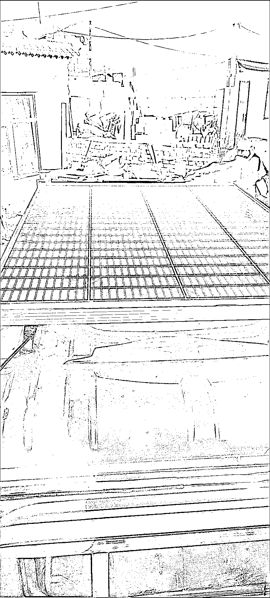
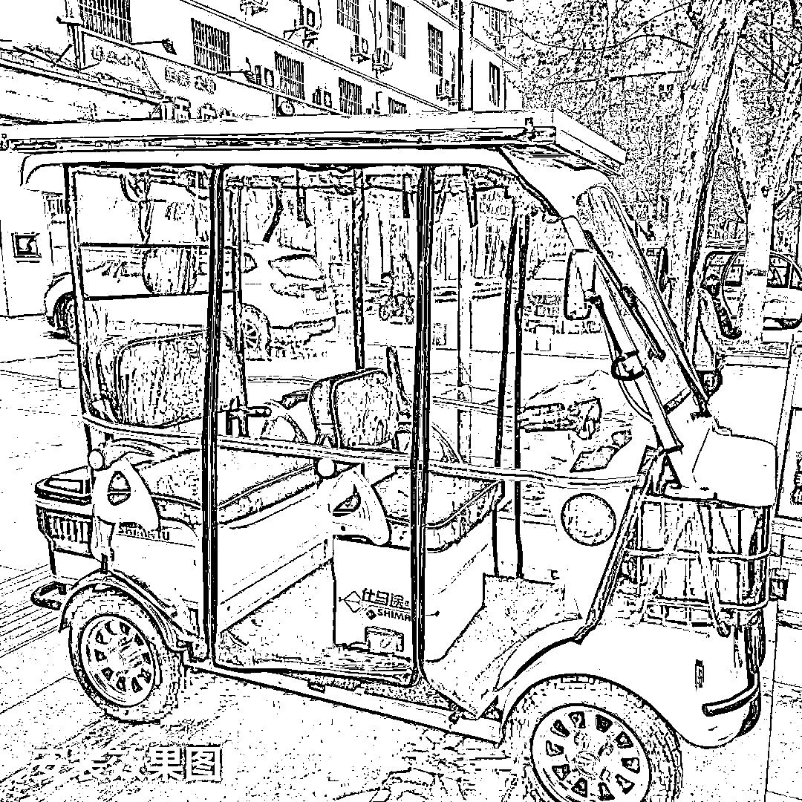
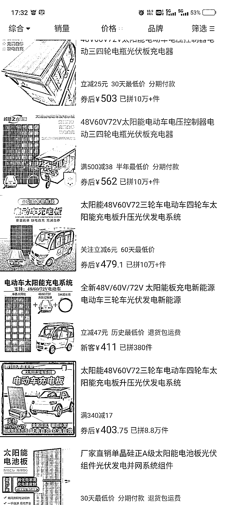

# 电动三四轮车顶太阳能充电板，可以通过视频号、抖音引流

> 原文：[`www.yuque.com/for_lazy/xkrm14/bbuqrxifwpfyq7zg`](https://www.yuque.com/for_lazy/xkrm14/bbuqrxifwpfyq7zg)

作者： 二虎

日期：2023-05-02

点赞数：66

正文：

电动三四轮车顶太阳能充电板 昨天在老家看到一辆老年代步车上有安装，拼多多搜了一下感觉销量还不低，客户主要是下沉市场的电动三轮车四轮车用户，还有一些送快递的车子也合适。 卖点①自动充电（省钱） ②遮阳隔热 ③不带棚的三轮车安装还可以充当雨棚 我觉得可以通过视频号，抖音或者快手引流，毕竟拼多多和淘宝这种搜索类的网站老年人很多不会用。

评论区：

风轻云淡 : 电瓶车是否也可以考虑[呲牙]

二虎 : 电瓶车不好安装吧，没地方装，改棚子的话又不安全

胡洋 : 得先问过交警叔叔吧，我们这电瓶车凡装棚子立马逮住拆掉

