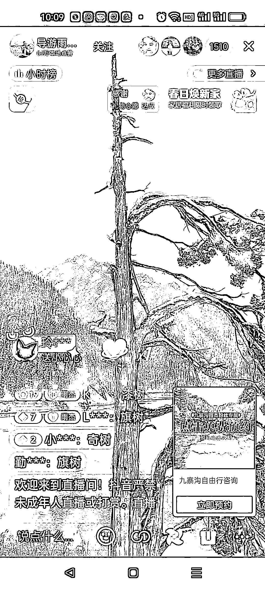

# 抖音旅游卖货形式：导游 + 口播历史故事 + 卖货

> 原文：[`www.yuque.com/for_lazy/xkrm14/dggzdl9qswbx2wyv`](https://www.yuque.com/for_lazy/xkrm14/dggzdl9qswbx2wyv)

作者： Mia 米娅

日期：2023-04-27

点赞数：46

正文：

导游（正带队正用手机拍摄景点直播）+口播历史故事+卖货 可卖当地的特产也可卖补气血的人参饮品，保健品（导游要一直说话和走动容易累，补气血效果好现身说法） 碎碎念：我妈（中老年）特别痴迷，相当于云旅游，还能听小故事，挺乐呵。一天下单了好几笔这些导游带的补气血的保健品。我眼前一晕，也不好说啥。

  

  

评论区：

林家少爷 : 女人是消费主力军

公众号懒人找资源，懒人专属群分享

