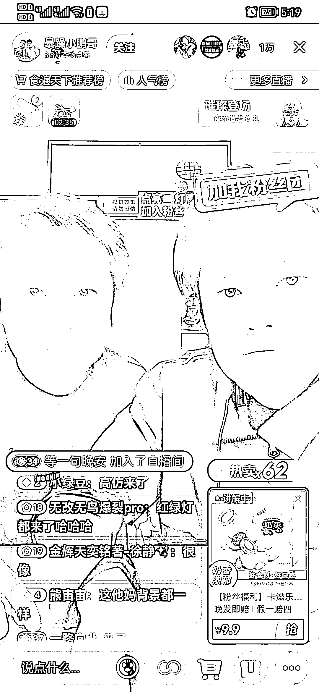
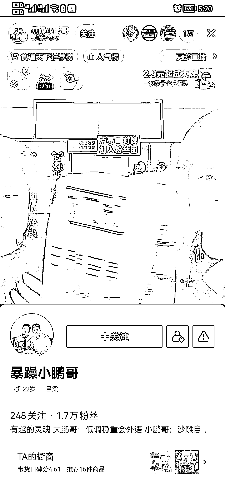

# 抖音模仿大小杨风格的直播间，流量拉满

> 原文：[`www.yuque.com/for_lazy/xkrm14/wfrgy529hsihdvbh`](https://www.yuque.com/for_lazy/xkrm14/wfrgy529hsihdvbh)

作者： 阿泽

日期：2023-04-26

点赞数：71

正文：

今天刷抖音无意中看到这个直播间 真的完美诠释了万物皆可抄 直接还原小杨哥带货直播间，主播也是模仿大小杨的风格，流量拉满，一万+在线 弹幕话题点直接拉满 看了一下他的视频段子，最近没有模仿小杨哥，是模仿李炮儿，粉丝提挑战，他们去执行，视频数据一直递增性爆发！ 所以总结一下，拆爆款找对标账号的意义就在这里，如果是新手，真的不能凭自己感觉去做内容，不能自我感觉良好 前期可以一比一像素级模仿 你模仿之中也是在提升自己各方面的能力 模仿多了之后，融汇贯通 后面自己做内容的时候会更加得心应手，更容易出爆款 之前做手游 cps 靠拆解爆款视频，一比一模仿，成功爆过 800w 播放和 500w 播放的视频，几十万播放的有很多

  

评论区：

大梁 : 秀，别人只是想到了，他是做到了[捂脸]

阿泽 : 是的，执行力强

