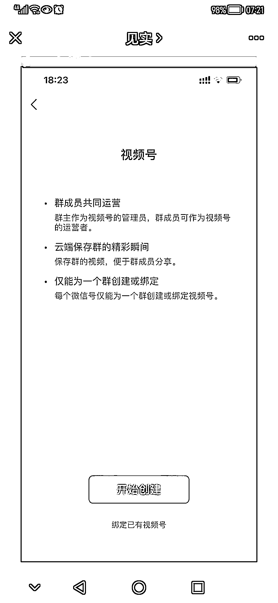
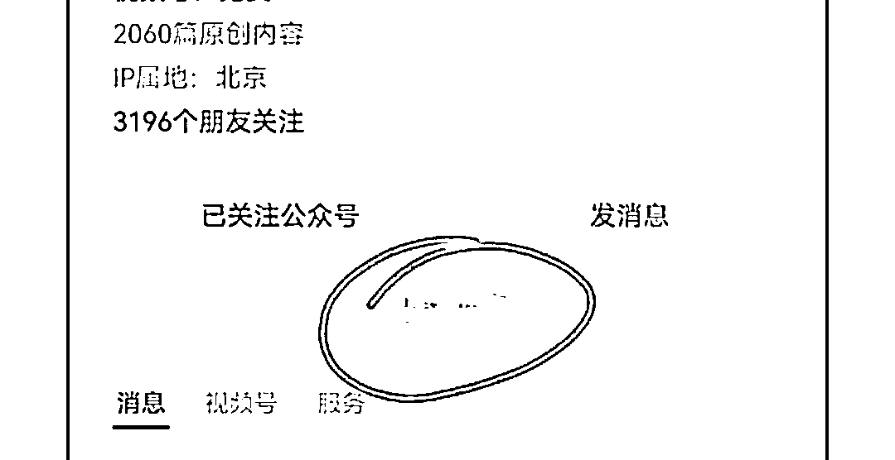

# iOS 微信又发布了 8.0.37 正式版，三个新功能开始灰度内测

> 原文：[`www.yuque.com/for_lazy/xkrm14/lpskusr1s9x7zxwg`](https://www.yuque.com/for_lazy/xkrm14/lpskusr1s9x7zxwg)

作者： 作书

日期：2023-04-29

点赞数：24

正文：

继 iOS 微信 8.0.36 版本更新仅一周后，昨日 iOS 微信又发布了 8.0.37 正式版，三个新功能开始灰度内侧： 改版 1：微信群和视频号继续深度打通 新版本中，微信群的设置界面新增了“视频号”功能，该功能支持群内成员共同运营一个视频号账号，并能在云端保存群内视频，不过该功能还在内测中，只有少部分 8.0.37 版用户可以体验到。 改版 2：视频号小店将“挤进”公众号主页 除了微信群，视频号灰度内测的“触角”还伸向了公众号。如下图 2 所示，微信公众号主页还支持直接添加“视频号小店”入口。 改版 3：微信 Mac 版可同时打开多个页面 除这些 ios 端更新外，Mac 版微信在前几天也迎来了 3.7.1 版本更新。 以往 Mac 微信只能同时开启一个网页窗口，在新版本更新后，微信 mac 客户端公众号链接和视频号等一系列页面均可同时打开。本次更新极大增加了微信内阅读的舒适度，使用户获得更丝滑的阅读体验。

  

  

  

评论区：

大谢.₂₀₁7 : 感谢分享，想知道每次微信更新，具体的更新内容，在哪里可以查看呢，谢谢

作书 : 微信放大镜🔍“每次微信更新，具体的更新内容在哪里可以查看”，或自己更新最新版本，试试呗，抑或微信官方平台

作书 : 感谢亦仁大大

