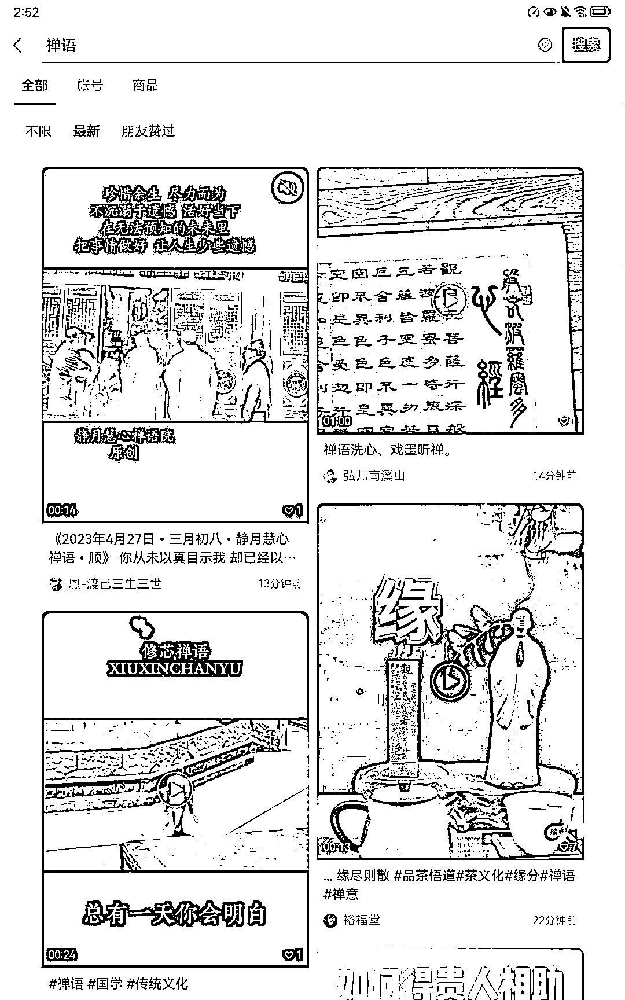
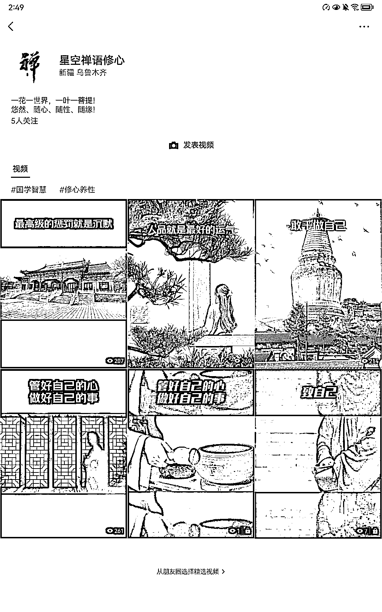

# “禅语”微信指数热度很高

> 原文：[`www.yuque.com/for_lazy/xkrm14/sqalbfzraxwdto7m`](https://www.yuque.com/for_lazy/xkrm14/sqalbfzraxwdto7m)

作者： 万能神

日期：2023-04-27

点赞数：39

正文：

就是上次看精华点有位兄弟说那个微信视频号主要是中老年受众。 然后我就突发奇想到这个禅语，我发现抖音快手这些同行都比较多了，然后小红书的年轻女性也不看。 然后就搜了微信指数，就发现这几天热度挺高的（有很多起的号） 再搜一下视频号禅语，发现视频都是小学生选手，和抖音快手上边的大学生是无法比的 我也做了几个视频都是二创的，但是不想做了，因为我不太会变现。

  

  

  

  

  

  

评论区：

万能神 : 我真的爆流量了，直接纯纯热门

witon : 爆了多少流量撒

胡北北 : 变现就是卖佛学的周边产品，或者书籍，或者拉交流群

鬼谷子 : 这个挺好，我朋友去年这个方面变现千万

闲米 : 直接带货呀，圈友

不二 : 变现模式是什么呀

万能神 : 几万，涨了 300 粉

