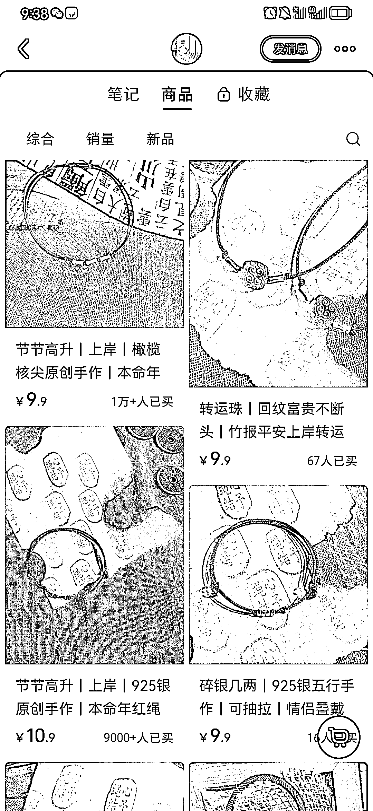
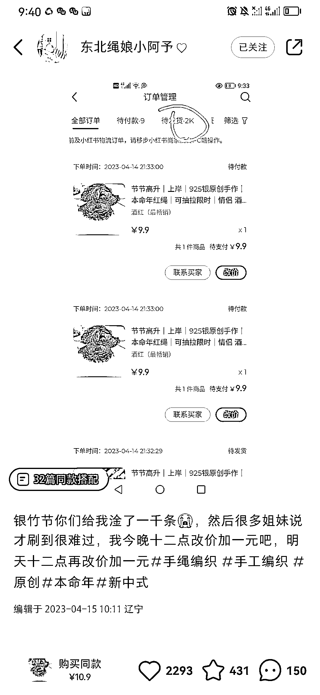

# 小红书卡着时间节点发相关的作品，可能会出现爆款

> 原文：[`www.yuque.com/for_lazy/xkrm14/gm8nxsgu5mtzulee`](https://www.yuque.com/for_lazy/xkrm14/gm8nxsgu5mtzulee)

作者： 陈知意

日期：2023-05-01

点赞数：51

正文：

在小红书平台上，如果卡着时间节点，比如考研出成绩之前，考公出成绩之前，等等时间去发相关上岸的一些作品，可能会出现爆款。 比如这个做手作的一个姑娘，赶着时间节点发布了上岸的银竹节作品，带给别人好的寓意定价不高，9.9 元，卖出 2000 条以后再发作品说，由于原材料涨价，打算涨一块钱也不多，这样也会有很多人愿意购买，而且一般都买两条以上自己带以及送人。 赶上时间节点，多发布一些关于上岸的作品，是容易出爆款的。

评论区：

陈知意 : 谢谢亦仁老师

