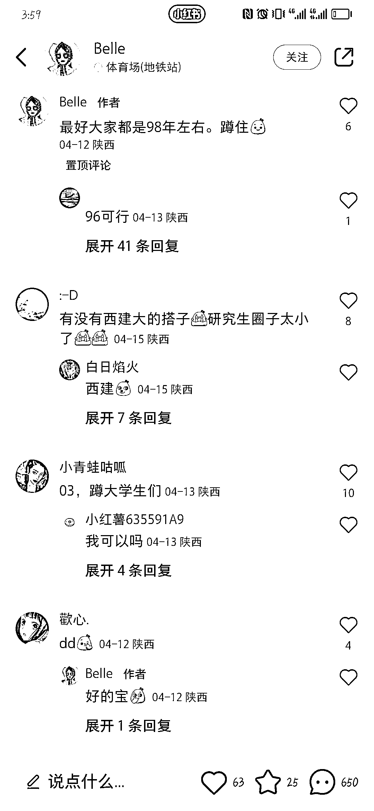
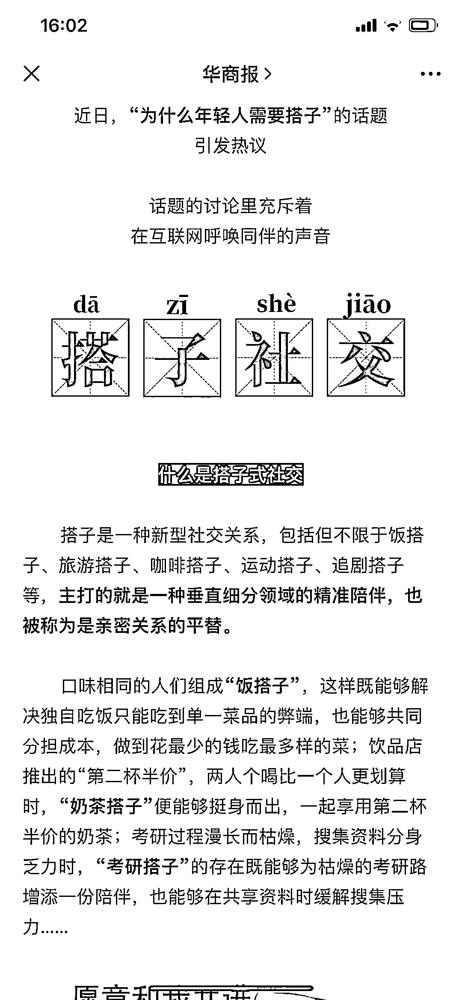

# 小红书发布“找搭子“笔记，点赞转粉率不高，但互动率超级高

> 原文：[`www.yuque.com/for_lazy/xkrm14/gtx1vg8tui2fcwiu`](https://www.yuque.com/for_lazy/xkrm14/gtx1vg8tui2fcwiu)

作者： 昊峻

日期：2023-04-26

点赞数：79

正文：

小红书发布"找搭子"笔记，点赞转粉率不高，但互动率超级高。并且几乎全部都是本地粉。 一些官方媒体公众号也有报道，评论区也是和小红书一样都是求搭子的。 变现路径可引流到私域，做本地生活转化。

  

  

评论区：

宋清尘 : 引流特别牛，我做了两个号都能引流很多，而且流量持续。

昊峻 : 可以分享下你的变现路径吗？

宋清尘 : 看引流的内容吧，我没有去做变现。一个是户外运动引流，适合带团旅行（也适用轰趴馆）这种玩法。一个是读书的，做了一个读书会（也适用自律打卡类）的活动。

爱吃鱼丸的蓝波 : 我是小白，想问一下引流之后干嘛

宋清尘 : 看目的，比如我有一个是读书搭子的引流，加了之后组了一个线上读书会的项目。

蛤蟆先生 : 读书会收费的吗

阿凡达的忧伤 : 学到了

宋清尘 : 我是先免费，后收费。

公众号懒人找资源，懒人专属群分享

