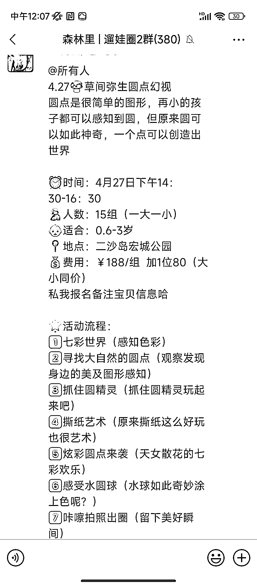

# 在小红书发表在广州一起遛娃的笔记，虽然点赞少，评论区互动好

> 原文：[`www.yuque.com/for_lazy/xkrm14/acvmyqlid57ihb6p`](https://www.yuque.com/for_lazy/xkrm14/acvmyqlid57ihb6p)

作者： 家欢

日期：2023-04-25

点赞数：40

正文：

在小红书发表在广州一起遛娃的笔记。虽然点赞少，评论区却好的很。 博主通过评论区引流到后邀请进一起遛娃群。平时都是宝妈们自活跃。后面才发现博主通过组织一起遛娃活动来做广州线下生活。 在一个宝妈群我也看到群主通过快团团推遛娃活动收费多少来吸引宝妈的。而且疫情后妈妈对遛娃活动真的需求很旺盛。而且有那么多姐妹一起遛娃，真的是很不错的选择。

评论区：

Mr. 胡添翼 : 明天去试试

家欢 : 可以的，动起来

