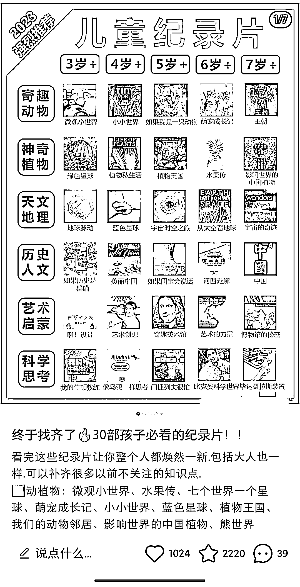
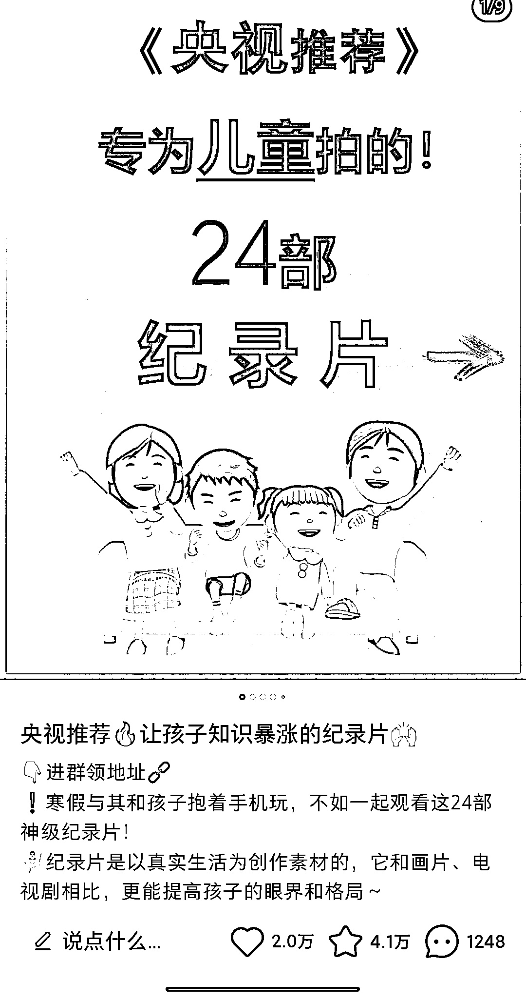
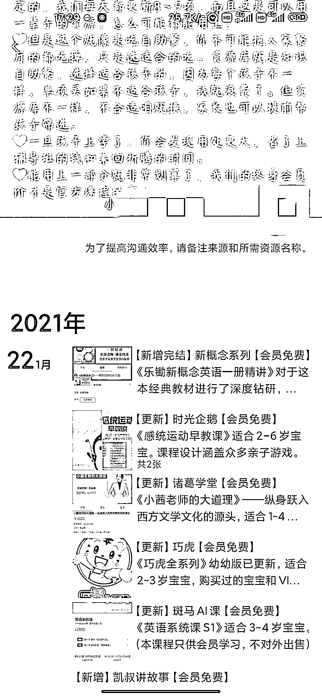

# 小红书合集类笔记新玩法，整理适合小学生和幼儿看的纪录片动画片，引流宝妈粉

> 原文：[`www.yuque.com/for_lazy/xkrm14/yg0cucku2agis5b2`](https://www.yuque.com/for_lazy/xkrm14/yg0cucku2agis5b2)

作者： 白宝香

日期：2023-04-24

点赞数：89

正文：

小红书合集类笔记，整理适合小学生，幼儿看的纪录片动画片之类的，3-10 岁，引流到私域，送资料卖资料卖课。 因为是有益于开拓孩子视野，科普类的，挺多宝妈问资源。 拓展:也可以发在抖音图文，视频号等其他平台 变现: 1.引流到私域，就是一个有很多目标群体宝妈的号，卖号也是一种变现方式，或者找其他方式利用私域变现； 2.直接免费分享网盘资料，或者卖网盘资料，结合夸克网盘拉新； 3.卖 U 盘资料，U 盘里面有下载好的纪录片电影等；（以前看到过这种）； 4.卖各种课程； 5.宝妈号，私域带货卖母婴产品也可以； 6.其他变现方式结合自己具体业务等等；

  

评论区：

生财青蛙 : 结合夸克网盘拉新

白宝香 : 是的 可以的 写了[偷笑]

田螺姑娘 : 心动

白宝香 : 感兴趣可以去试试 做一下[强]练练手也行😄

