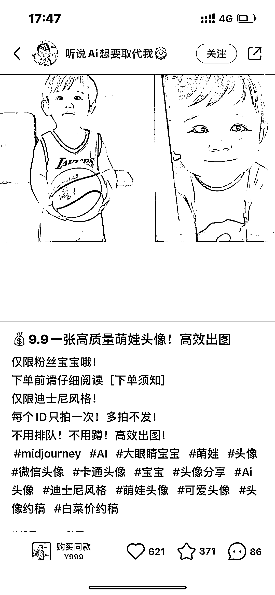
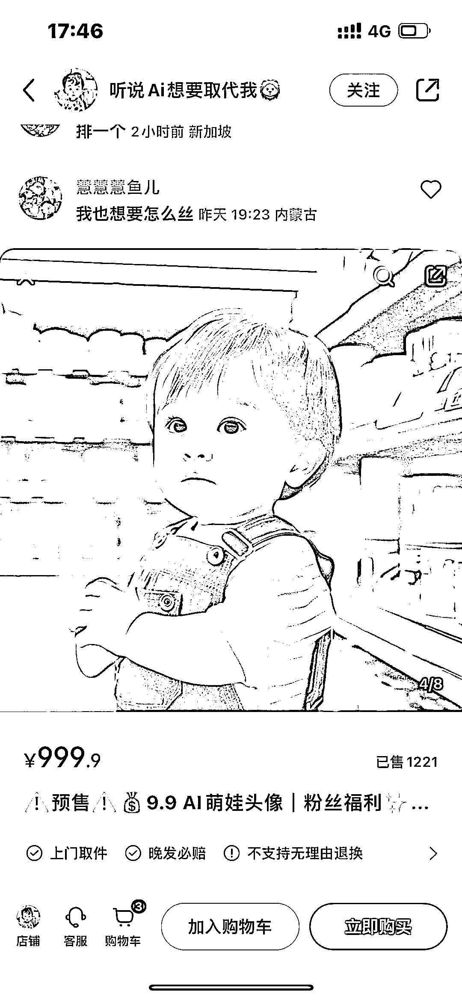
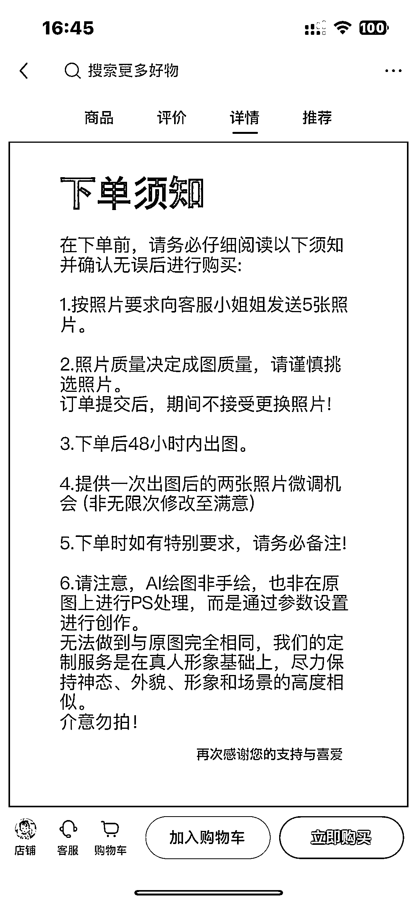

# 9.9 元在小红书卖了 1200 单，收入 10000+

> 原文：[`www.yuque.com/for_lazy/xkrm14/oneqlgc0d6811w5b`](https://www.yuque.com/for_lazy/xkrm14/oneqlgc0d6811w5b)

作者： 张义维

日期：2023-04-24

点赞数：147

正文：

9.9 元 在小红书卖了 1200 单，收入 10000+，[强]

  

  

  

  

  

评论区：

饭饭 : 这个牛

纪言🍃 : 牛

小侯的王先生 : 直接照抄[色]

生财青蛙 : 跟随

创业老杨 : 效果如何

 桥豆麻袋 : 好厉害！

Mr.小明 : 厉害，抓住了小孩这个群体

