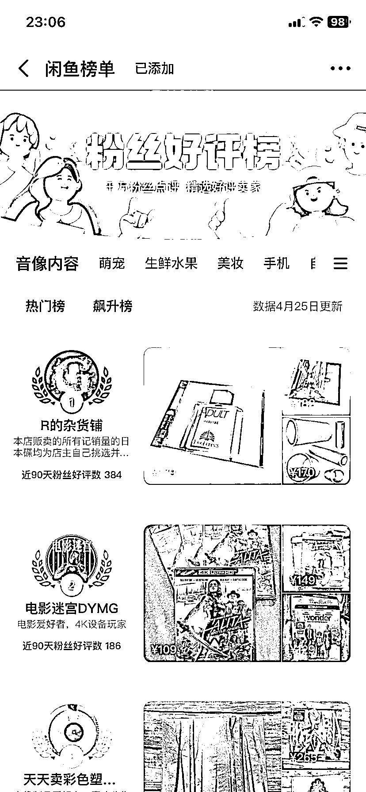

# 闲鱼榜单：一个非常好用的选品和找对标账号的工具

> 原文：[`www.yuque.com/for_lazy/xkrm14/ffk35cgyrlg015yh`](https://www.yuque.com/for_lazy/xkrm14/ffk35cgyrlg015yh)

作者： 浮沉

日期：2023-04-30

点赞数：105

正文：

闲鱼上有一个非常好用的选品和找对标账号的工具，那就是【闲鱼榜单】。 在闲鱼首页，找到闲鱼榜单，进去之后可以找对应的类目，比如音像制品，工业等，然后就可以看到对应的热门榜、飙升榜和新人榜，根据这些榜单就能看到你感兴趣的同行在卖什么产品，我想要和销售情况如何，再通过产品图片去其他平台比价，有利润空间即可上架，或者跟着对标账号去上架产品，简单、快捷、易上手。 同时，你也可以根据榜单的规则，让自己快速上榜，拿到部分通过榜单查看的自然流量。

  

  

  

  

  

  

评论区：

渊 : 要开通鱼小铺才有吗

浮沉 : 不需要也有，在首页导航上边左滑就能看到

BetterMan : 请问一下，在没货源的情况下怎么上架呢？有没有操作经验。刚来剩菜的信任

浮沉 : 不需要货源，我们都是做无货源的买卖。阿里巴巴，淘宝，淘特，拼多多遍地都是货源，甚至闲鱼平台的商品就可以作为货源。

述 : 有用[呲牙]

愚蠢的大猩猩😎 : 请问可以加 v 详细跟您学习一下吗？

浮沉 : 可以的，看我介绍里有。

阿凡达的忧伤 : 为啥我没有找到[捂脸][捂脸]

公众号懒人找资源，懒人专属群分享

