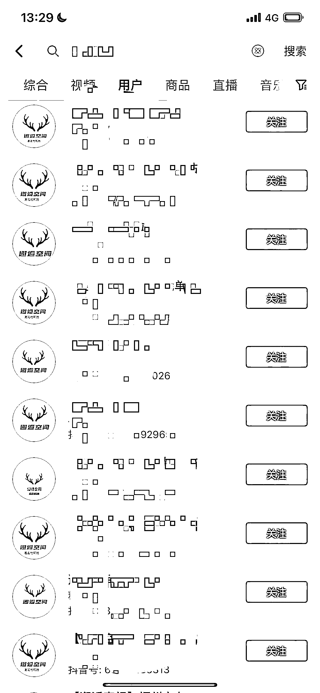

# 相亲和交友类的矩阵，纯自然流量获取客资

> 原文：[`www.yuque.com/for_lazy/xkrm14/ru9wno0betnc8fxb`](https://www.yuque.com/for_lazy/xkrm14/ru9wno0betnc8fxb)

作者： 楚川

日期：2023-04-30

点赞数：35

正文：

相亲和交友类的矩阵，选择 5 个左右的内容模板，一天发视频 10 条以上，纯自然流量获取客资。客单价 3000 起，一个账号可以导流 3-5 个/天，转化率在 20%。整个流量操盘团队是剪辑+运营，2 个人。

  

评论区：

如也 : 好像打码了，又好像没打码

红日 : 说的好像很对[呲牙]

野猫 : 明明打了🐴，你却没看见。

野猫 : 不好意思，你不认识明明，不过，你肯定认识羊羊[捂脸]

纪玮 : 相亲交友在抖音属于风险类目，封号比较严重，矩阵也是

楚川 : 内容很关键

南方姑娘 : 后端对接给别人团队？

楚川 : 项目初期怎么分工，这个得谈好

