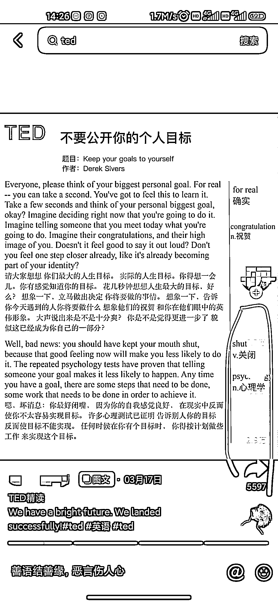

# 通过 TED 电子版笔记分享养号

> 原文：[`www.yuque.com/for_lazy/xkrm14/nd4zc0g93a5u5gxg`](https://www.yuque.com/for_lazy/xkrm14/nd4zc0g93a5u5gxg)

作者： 白宝香

日期：2023-04-26

点赞数：67

正文：

通过 ted 电子版笔记分享，把号养起来，数据做起来，点赞收藏就多了 下面这个号数据爆了一条视频，数据很好，点赞 7.7w，收藏 2.9w 号起来流量起来后，有人想买纸质版，就可以直接去橱窗下单，带货 ted 活页笔记纸质版 变现 1.抖音直接带货 ted 活页纸质版 2.卖 ted 电子版资料 3.也可以免费分享电子版资料，引流到私域

评论区：

白宝香 : 免费分享资料，就结合夸克拉新来做

热爱 : 想问一下这个 ted 笔记资源哪里来啊

白宝香 : 现成的话电子文件，可能是某个人整理出来的，去抖音小红书搜就有了，直接买或者问那些免费分享的博主。 如果想自己制作，有网站有工具（可能得自己找一下）可以提取 ted 演讲视频里面的英文句子，英译中，就可以了。

白宝香 : 纸质资源的话，有电子版后可以自己找厂家印刷 也可以开橱窗带货别人现成的纸质 ted 活页笔记产品，带货拿佣金，抖音可以搜到的

安迪 : 开小红书和抖音店铺，需要什么资质吗，比如出版社许可证、个体工商户？

白宝香 : 直接去小红书官方/抖音官方 看，更详细～

白宝香 :

安迪 : 好的，感谢感谢

公众号懒人找资源，懒人专属群分享

