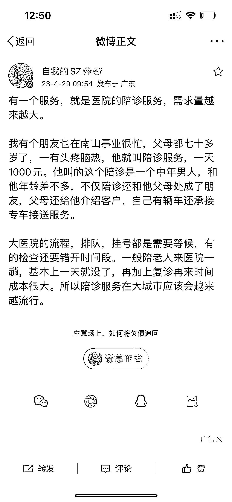

# 医院的陪诊服务，需求量很大

> 原文：[`www.yuque.com/for_lazy/xkrm14/wkkoc7eak2fuqefd`](https://www.yuque.com/for_lazy/xkrm14/wkkoc7eak2fuqefd)

作者： 小森林

日期：2023-04-29

点赞数：89

正文：

陪诊服务

评论区：

初十 : 接单是在平台吗

马律师|沈阳 : 注意把握风险，容易产生纠纷

阿白 : 已经做的很顺利了，需要的话，我可以分享给你

小森林 : 好的呀

小森林 : 谢谢提醒

小森林 : 需要自己引流哈

阿飞绒绒 : 同求，求链接圈友

阿白 : 可以跟家政公司和养老院、社区卫生服务中心合作获客。 接单~签合同（哪家医院，哪位医生，初复诊，挂号，病人的基本情况，可否自理，可否车接车送，是否需轮椅，是否有服药，上次检查）……陪诊半天费用全全天费用等等。合同一式三份。 陪诊的工作人员前期自己去，医院的医护人员兼职也行。 挂名医号，加塞，找床都不包含陪诊服务费，单算。 我们定价上午半天什么都不包 88 服务费。挂名医号服务费 100-500 不等（不包含挂号费），加塞 100-1000 不等，找床 100-500 不等。 66，88，168，198，268，298，368，398。300～500。 66 是便民门诊取药的服务费。 住院需要提供陪护的服务费是 300-500。 合同细节根据病人的基础信息制定，每人不一。 以上陪诊不包括儿科和产科。 产科需要（代签字，3-7 日月嫂，育儿嫂服务费不一。 处理胚胎🙏单独收费价格不一，部分设计火葬费。） 儿科需要（陪玩，陪检查，住院陪护，提供 ICU 视频等特殊，服务费不一）。 接单最多的代取💊，代挂号（提前 3-7 天），当天加收服务费不一，陪床，加塞，找床。 个人干的话，3 人即可。 单独一个人，代取药，代挂号，代咨询，代打单。引流就私域即可。干的就是辛苦活和关系活。

公众号懒人找资源，懒人专属群分享

