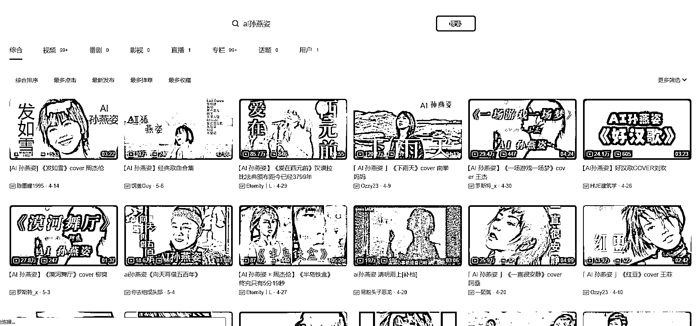
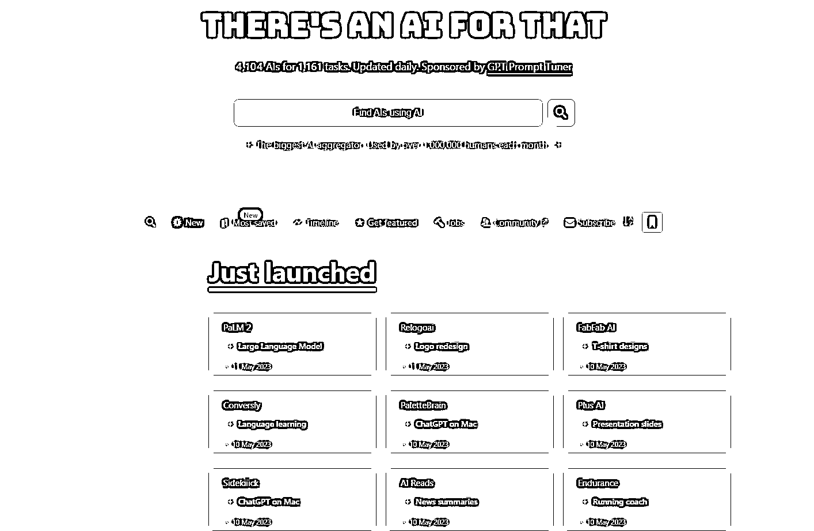
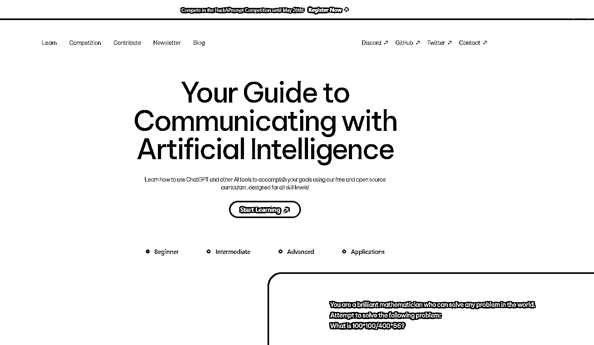

# ChatGPT + 海外工具分享

> 原文：[`www.yuque.com/for_lazy/xkrm14/og8gignt8tpkpfnx`](https://www.yuque.com/for_lazy/xkrm14/og8gignt8tpkpfnx)

<ne-p id="u05ad4af3" data-lake-id="u05ad4af3"><ne-text id="u6edc3748">作者： 苓枫</ne-text></ne-p> <ne-p id="ue87ba006" data-lake-id="ue87ba006"><ne-text id="u525bad88">日期：2023-05-11</ne-text></ne-p> <ne-p id="uc9c3aa90" data-lake-id="uc9c3aa90"><ne-text id="uc0845e6f">点赞数：</ne-text><ne-text id="uac9210d4" ne-bold="true">135</ne-text></ne-p> <ne-hole id="ue412c796" data-lake-id="ue412c796"><ne-card data-card-name="hr" data-card-type="block" id="Nh4V6" data-event-boundary="card"><ne-p id="u163b30fe" data-lake-id="u163b30fe"><ne-text id="uf9cfd47c">正文：</ne-text></ne-p> <ne-p id="u9bcee0fe" data-lake-id="u9bcee0fe"><ne-text id="u43315b48">上次分享了和电商有关的 AI 工具网站以及我自己的思考，很幸运获得了亦仁大佬的中标以及生财好友的 100 多个点赞，鱼丸也拉我进了风向标 3 群。这给了我作为一个新人挺大的鼓励的，谢谢各位圈友的认可，这次继续分享我所看到的海外赚钱思路，这次航海我也积极参加了 chatgpt+海外工具的志愿者，欢迎大家搭上 chatgpt 的船</ne-text> <ne-text id="ub41e0c0a">神采 PromeAI 分类：设计 AI 地址： 介绍：这是国内开发的一款设计 AI，可以用于产品设计、室内设计、建筑设计、游戏/动漫人物设计，电商设计等</ne-text> <ne-text id="u592b27d7">公司经过算法优化，整理出比较有针对性和可具体商用的功能进行开发，有免费版本，可试用 想法：</ne-text> <ne-text id="u946f2509">1、个人：可以用于公司产品设计、室内设计、建筑设计、游戏/动漫人物设计辅助神器 2、有资源的：可以做分销 3、软件公司：可以做个类似的网站</ne-text> <ne-text id="u1d861ad7">AI 工具站点|电商需求 分类：AI 工具站点 地址： 流量：240 万/月 增速：80 万/月 介绍：做了一系列的工具,感觉都挺实用的，电商需求也挺好</ne-text> <ne-text id="u46b06f17">看下面两个： 想法： 1：如果能做返利，我直接加入返利 2：这种 model 感觉还是很厉害 AI Prompt 站点 分类：AI Prompt 地址：</ne-text> <ne-text id="ud08804c7">流量：36.6 万/月 增速：36.6 万/月 介绍： prompt 和教程站的速度都好快 想法： 1：用他的方式做一个多语言的 AI 歌手|AI 孙燕姿</ne-text> <ne-text id="u2eb094a4">分类：AI 应用 地址： 流量：百万 介绍： 请看视频 想法： 1：当然是卖教程 2：当然是做一些引流卖教程 想想让孙燕姿为你唱首歌 AI 追踪|AI 导航</ne-text> <ne-text id="uc30db855">分类：AI 导航 地址： 流量：250 万/月 介绍： 这个导航好奇怪 50%的搜索来量 AI 换衣 分类：AI 工具 地址： 流量：34.6 万/月</ne-text> <ne-text id="ub7901e77">增速：34.6 万/月 变现：9.9/月（最低版) 介绍： 上个月我们看到只有 20 万的流量，现在有 30 多万 上次看到是最低是 29 刀现在调整为 9.9 想法：</ne-text> <ne-text id="u968b266d">1：这个做成一个 APP 应该有市场 2：这个和电商结合有市场 AI 学习教程 分类：AI 教程 地址： 流量：210 万/月 流量增速：100 万/月</ne-text> <ne-text id="ua24dcc03">介绍：了解如何使用 ChatGPT 和其他 AI 工具通过我们专为所有技能水平设计的免费开源课程来实现您的目标！ 想法：</ne-text> <ne-text id="uf5f5d7fc">1：当然是抄一个了，刺激不刺激</ne-text>[<ne-text id="u4fe8afce">探索 AI 的无限可能性+-+神采 PromeAI</ne-text>](https://www.promeai.com/?vsource=Lf509) [<ne-text id="ucd7e4480">Create+Ultra+Realistic+AI+Art+Generator+For+Free</ne-text>](https://www.zmo.ai/) [<ne-text id="u4cff94ea">On+Model+Images,+Photography+For+Fashion+Brands+|+...</ne-text>](https://www.zmo.ai/aimodels/) <ne-text id="u0ea5574f">Background+Generator+&+Remover+|+Background+AI</ne-text> <ne-text id="u0e208b6b"><ne-text id="u7020ca7c">ai)</ne-text>[<ne-text id="u81aaadd9">ChatGPT+Shortcut+-+简单易用的+ChatGPT+快捷指令表，让生产力倍增！标签筛选...</ne-text>](https://www.aishort.top/) [<ne-text id="u953853ca">ai 孙燕姿-哔哩哔哩 _Bilibili</ne-text>](https://search.bilibili.com/all?vt=00271011&keyword=ai%E5%AD%99%E7%87%95%E5%A7%BF&from_source=webtop_search&spm_id_from=333.1007&search_source=5) [<ne-text id="u167a86c5">There's+An+AI+For+That+-+The+Biggest+AI+Aggregator</ne-text>](https://theresanaiforthat.com/) [<ne-text id="u9752d34b">Outfits+AI</ne-text>](https://www.outfitsai.com/) [<ne-text id="u23abef05">https://learnprompting.org/</ne-text>](https://learnprompting.org/)</ne-p> <ne-p id="u58334d78" data-lake-id="u58334d78"><ne-card data-card-name="image" data-card-type="inline" id="KXJjW" data-event-boundary="card">  <ne-p id="ue5b94476" data-lake-id="ue5b94476"><ne-card data-card-name="image" data-card-type="inline" id="MaD7u" data-event-boundary="card">  <ne-p id="u1834a9be" data-lake-id="u1834a9be"><ne-card data-card-name="image" data-card-type="inline" id="qyDcH" data-event-boundary="card">  <ne-p id="uc8197001" data-lake-id="uc8197001"><ne-card data-card-name="image" data-card-type="inline" id="T4IFu" data-event-boundary="card">  <ne-p id="u91d62d00" data-lake-id="u91d62d00"><ne-card data-card-name="image" data-card-type="inline" id="caG7d" data-event-boundary="card">  <ne-p id="uc10e1d0b" data-lake-id="uc10e1d0b"><ne-card data-card-name="image" data-card-type="inline" id="kGp8u" data-event-boundary="card">  <ne-p id="u322e3f3a" data-lake-id="u322e3f3a"><ne-card data-card-name="image" data-card-type="inline" id="rQ56B" data-event-boundary="card">  <ne-p id="u2dada660" data-lake-id="u2dada660"><ne-card data-card-name="image" data-card-type="inline" id="Wk9UO" data-event-boundary="card">  <ne-hole id="ufd440a4a" data-lake-id="ufd440a4a"><ne-card data-card-name="hr" data-card-type="block" id="gLadN" data-event-boundary="card"><ne-p id="ub8934f98" data-lake-id="ub8934f98"><ne-text id="ud08e0959">评论区：</ne-text></ne-p> <ne-p id="u7efd170e" data-lake-id="u7efd170e"><ne-text id="ua990eb13">苓枫 : 流量统计的网站是 Similarweb</ne-text></ne-p> <ne-p id="u46da6a01" data-lake-id="u46da6a01"><ne-text id="ue1316717">苓枫 : 谢谢亦仁大佬，我会继续分享我所了解到的赚钱风向标，争取一个月中标 5 个以上[嘿哈]</ne-text></ne-p> <ne-p id="u036f0e87" data-lake-id="u036f0e87"><ne-text id="ub5640dac">王大牛先生 : 优秀~</ne-text></ne-p> <ne-p id="u9669b91a" data-lake-id="u9669b91a"><ne-text id="u0afff961">一瓶香菇酱 : 优秀，海外视频、会议 summary 方向也不错，相关工具插件可以搞搞。</ne-text></ne-p> <ne-p id="ufb783132" data-lake-id="ufb783132"><ne-text id="u7a0978c8">潮州痞子蔡 : 孙燕姿那个还是要注意下，后续不知道是否会涉及法律问题</ne-text></ne-p> <ne-p id="uee6aaf30" data-lake-id="uee6aaf30"><ne-text id="u7c140384">郑鹏鑫 : 优秀</ne-text></ne-p> <ne-hole id="ud1648bf0" data-lake-id="ud1648bf0"><ne-card data-card-name="hr" data-card-type="block" id="qYl7I" data-event-boundary="card"><ne-p id="u2db2a19c" data-lake-id="u2db2a19c"><ne-text id="u6bb9fc00">公众号懒人找资源，懒人专属群分享</ne-text></ne-p></ne-card></ne-hole></ne-card></ne-hole></ne-card></ne-p></ne-card></ne-p></ne-card></ne-p></ne-card></ne-p></ne-card></ne-p></ne-card></ne-p></ne-card></ne-p></ne-card></ne-p></ne-card></ne-hole>