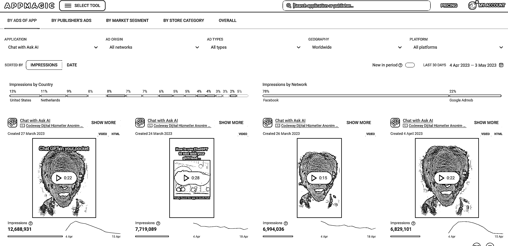

# 套壳 AI 聊天应用，月收入 1000W+ 人民币

> 原文：[`www.yuque.com/for_lazy/xkrm14/yfuci3kyb9sgud44`](https://www.yuque.com/for_lazy/xkrm14/yfuci3kyb9sgud44)

作者： 兴小哥

日期：2023-05-11

点赞数：51

正文：

套壳 AI 聊天应用，月收入 1000 万+人民币 据 Tweet 信息,Andrey 发现一个 AI 聊天应用“Ask AI”月收入 1000 万+人民币（这个数据表示存疑，来自一个日本推主，非原主）。 推主调查显示,这款应用在全球 60 个国家推出 iOS 和 Android 版本,已有 1000 万用户,由土耳其一家创业公司开发。 该应用非常简单,在用户界面提出“AI 问答”类似话题,选择话题后出现提示,发送后问题被发送到 Open AI API(GPT3.5)。 盈利方式为每周 80 人民币或永久 700 人民币的“无限访问”收费,有限的免费使用,超规定次数可以通过分享的方式解除限制。（这玩法……） 其他约 700 万人民币/月 AI 聊天应用有“ChatOn”、“Genie”和“AI Chat”，还有 10 几个赚了 100 万以上的。 表中还包含非 AI Chat 应用“Wonder”(AI 艺术生成)和“Impulse”(脑训练)。 Andrey 对“Ask AI”进行跟踪调查,总计赚取 3 百万美元(4500 万日元)。 Andrey 个人看法:全球 1 亿用户,付费转化率 0.1%即 1 万人,1 万人每周付 80 人民币,月收入 480 万人民币,无法获得全部收益,平台获 30%。 Andrey 使用市场调查工具“APPMAGIC”,操作简单。 国内也有很多 ChatGPT 套壳应用。 很多应用商业化程度还是太低了，甚至很多是引流状态，多数处于亏损状态。 碍于风险，建议出海卷。

  

  

评论区：

詹伟平 : 国内也有月入几十万的，很多闷声发财的小应用

公众号懒人找资源，懒人专属群分享

</ne-p></ne-p>