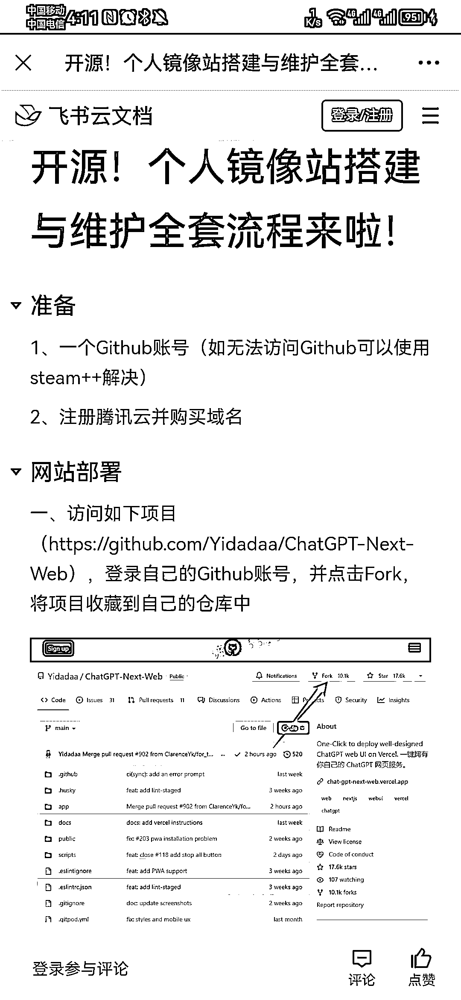
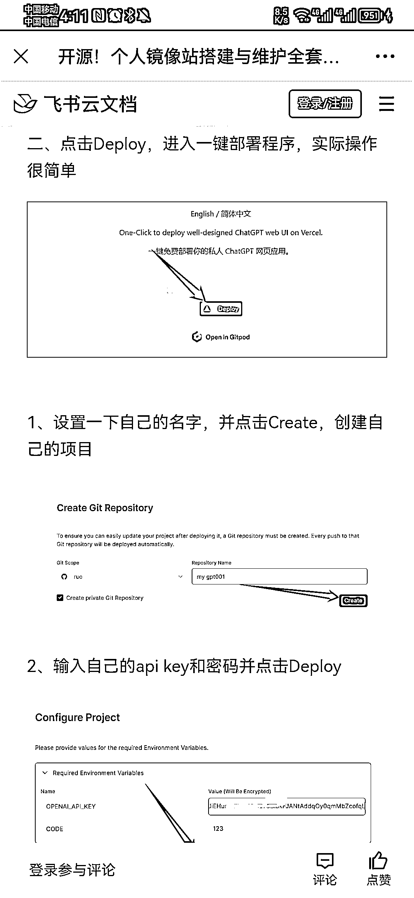

# 只需 4 块钱，就可以搭建一款专属 ChatGPT 中文版网站保姆级教程

> 原文：[`www.yuque.com/for_lazy/xkrm14/zrzctw7pr74rpc4m`](https://www.yuque.com/for_lazy/xkrm14/zrzctw7pr74rpc4m)

<ne-text id="ubd5f1ce1">作者： 君莫笑</ne-text>

<ne-text id="u5b007243">日期：2023-05-10</ne-text>

<ne-text id="u1454045d">点赞数：</ne-text><ne-text id="u0c96a7c8" ne-bold="true">200</ne-text>

<ne-hole id="u9767b1d9" data-lake-id="u9767b1d9"><ne-card data-card-name="hr" data-card-type="block" id="ILYe1" data-event-boundary="card">

<ne-text id="u9cf61f3e">正文：</ne-text>

<ne-text id="uf3c0e688">只需 4 块钱，就可以搭建一款专属 chatgpt 中文版网站。自己用或者卖授权码都可以，感兴趣的可以研究一下 保姆级教程：</ne-text> [<ne-text id="u668acb27">https://bw70jeu9g6.feishu.cn/docx/Gn10dYD04obtRAxj...</ne-text>](https://bw70jeu9g6.feishu.cn/docx/Gn10dYD04obtRAxj5aYcMEgWn1e)

<ne-card data-card-name="image" data-card-type="inline" id="iZvhI" data-event-boundary="card">  <ne-p id="u46dbd5dc" data-lake-id="u46dbd5dc"><ne-card data-card-name="image" data-card-type="inline" id="I0y53" data-event-boundary="card">  <ne-p id="u98e30343" data-lake-id="u98e30343"><ne-card data-card-name="image" data-card-type="inline" id="FAy0z" data-event-boundary="card">  <ne-p id="u6b20149d" data-lake-id="u6b20149d"><ne-card data-card-name="image" data-card-type="inline" id="twnjo" data-event-boundary="card">  <ne-p id="uea84ceba" data-lake-id="uea84ceba"><ne-card data-card-name="image" data-card-type="inline" id="NFIdM" data-event-boundary="card">  <ne-p id="u7eff8679" data-lake-id="u7eff8679"><ne-card data-card-name="image" data-card-type="inline" id="QWhTZ" data-event-boundary="card">  <ne-hole id="u36661a91" data-lake-id="u36661a91"><ne-card data-card-name="hr" data-card-type="block" id="HDEop" data-event-boundary="card"><ne-p id="uefb31b43" data-lake-id="uefb31b43"><ne-text id="u517ca8b8">评论区：</ne-text>

<ne-text id="ubea76331">果冻 : 搭建镜像会有法律风险么？</ne-text>

<ne-text id="u5545030d">白露 : 哈哈哈哈，我也觉得这是几个开源里面用的最顺手的一个</ne-text>

<ne-text id="u640843b2">麦格雷皮 : 这个看着不难，技术小白也可以操作，真棒！</ne-text>

<ne-text id="udddf64cc">骷比絨 : gpt 的 api 收费的吗</ne-text>

<ne-text id="u230aae5f">往事随风 : 关键是得能有 api key</ne-text>

<ne-text id="u96bbd589">君莫笑 : 免费阿，镜像的嘛，好好看教程</ne-text>

<ne-text id="u393333b5">君莫笑 : 肯定有啊，你好好看教程，很多人都按照上面就搞出来了</ne-text>

<ne-text id="u7332dde2">君莫笑 : 你这个担心多余了</ne-text>

<ne-hole id="u8697e615" data-lake-id="u8697e615"><ne-card data-card-name="hr" data-card-type="block" id="S5IpA" data-event-boundary="card">

<ne-text id="u7f492395">公众号懒人找资源，懒人专属群分享</ne-text>

</ne-card></ne-hole></ne-card></ne-hole></ne-card></ne-p></ne-card></ne-p></ne-card></ne-p></ne-card></ne-p></ne-card></ne-p></ne-card></ne-p></ne-card></ne-hole>