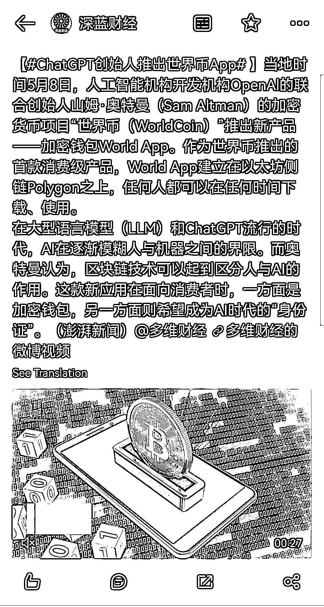

# Sam 推出加密钱包 world app，成为 AI 时代的“身份证”

> 原文：[`www.yuque.com/for_lazy/xkrm14/xgbu59ulzwos7u22`](https://www.yuque.com/for_lazy/xkrm14/xgbu59ulzwos7u22)

<ne-text id="uf8b3a89e">作者： 李纳</ne-text>

<ne-text id="u2a418af2">日期：2023-05-09</ne-text>

<ne-text id="u07cceb42">点赞数：</ne-text><ne-text id="u5ece5073" ne-bold="true">91</ne-text>

<ne-hole id="u76a1547c" data-lake-id="u76a1547c"><ne-card data-card-name="hr" data-card-type="block" id="WtzYz" data-event-boundary="card">

<ne-text id="u26f5c963">正文：</ne-text>

<ne-text id="u2ef60ebc">Open AI 创始人 Sam 推出加密钱包 world</ne-text> <ne-text id="u9f44b5d5">app，这款新应用在面向消费者时，一方面是加密钱包，另一方面则希望成为 AI 时代的“身份证”。Sam 觉得区块链技术可以起到区分人与 AI 的作用。</ne-text> <ne-text id="u30db2a74">就是说 AI 与 web3/区块链技术梦幻联动了[惊讶]</ne-text> [<ne-text id="uc9f25131">Sina+Visitor+System</ne-text>](http://t.cn/A6NRyQ36)

<ne-card data-card-name="image" data-card-type="inline" id="P4FkE" data-event-boundary="card">  <ne-hole id="u9b898836" data-lake-id="u9b898836"><ne-card data-card-name="hr" data-card-type="block" id="zbP6U" data-event-boundary="card"><ne-p id="ub07cd68d" data-lake-id="ub07cd68d"><ne-text id="ud6f7107a">评论区：</ne-text>

<ne-text id="u32dc09db">金九渊 : 以后可以用这个钱包充值 plus</ne-text>

<ne-text id="u4e923fc5">铸剑先生 : 有下载链接了么[呲牙]</ne-text>

<ne-text id="u7ddfacf3">大辉冯 : [强]</ne-text>

<ne-text id="u348bf3ab">骏马 : 厉害了！</ne-text>

<ne-text id="u4c101aa8">辛禾 : web 3 真正的落地应用来了</ne-text>

<ne-text id="u852a4d8f">Jason.W : 美区苹果谷歌账号可下，但在我国用不了，因为不能虹膜扫描</ne-text>

<ne-hole id="u2f874d7b" data-lake-id="u2f874d7b"><ne-card data-card-name="hr" data-card-type="block" id="WYjSs" data-event-boundary="card">

<ne-text id="ude273988">公众号懒人找资源，懒人专属群分享</ne-text>

</ne-card></ne-hole></ne-card></ne-hole></ne-card></ne-p></ne-card></ne-hole>