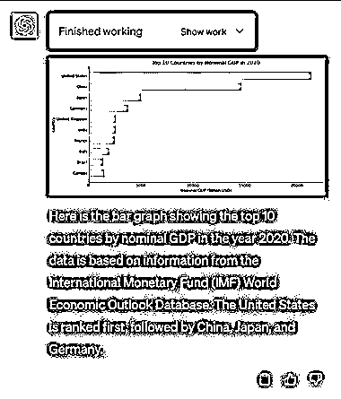

# ChatGPT 开启王炸模式！支持上传文件，一键搞定数据分析

> 原文：[`www.yuque.com/for_lazy/xkrm14/usrmdaz8fgv8r6qn`](https://www.yuque.com/for_lazy/xkrm14/usrmdaz8fgv8r6qn)

作者： TF 四夕

日期：2023-05-08

点赞数：38

正文：

ChatGPT 开启王炸模式！支持上传文件，一键搞定数据分析 最近，OpenAI 又为 ChatGPT 发布了一个新的插件：Code Interpreter，以往大家只是通过 ChatGPT 来帮忙写代码，现在可以借助这款插件直接执行代码并且返回结果。 在使用这款插件的时候会生成一个唯一的会话 ID，并启动一个新的沙盒环境来运行代码。该环境包括一个 Python 解释器和有限的库，以及一些临时磁盘空间。 也就是通过这款插件可以直接运行你输入的 Python 代码并且返回代码运行结果。 如何使用？ 使用 Code Interpreter 插件，需要先在 OpenAI 官网申请插件候补，等到申请通过了之后才可以使用插件功能。 具体能够实现什么功能？ 因为执行的是 Python 代码，所以能够实现的功能是非常多的。简单给大家举几个例子： 读取 Excel 表格：通过使用 Python 库，如 pandas，可以方便地读取 Excel 文件，并将数据加载到 DataFrame 中进行处理。同时，也可以使用其他的 Python 库，如 xlwt、openpyxl 等，来对数据进行修改。 创建图表：使用库如 matplotlib、seaborn 或 plotly，可以根据数据创建各种类型的图表。除此之外，您还可以使用 Python 的其他图表库，如 bokeh、ggplot 等，来创建更加复杂和美观的图表。 文件格式转换：使用 Python 来进行文件格式的转换，例如将 CSV 文件转换为 Excel 文件，或者将图片文件从一种格式转换为另一种格式。还可以使用 Python 的其他库，如 Pillow、wand 等，来对图片文件进行编辑和处理。 数据处理：Python 的库，如 pandas 和 numpy，可以用来处理和分析数据，例如过滤数据、进行统计分析等。通过使用：scipy、statsmodels 等 Python 库，可以进行更加复杂和深入的数据分析。

评论区：

小余同学 : 请问大佬带 alpha 标识的功能是怎么弄出来的

公众号懒人找资源，懒人专属群分享

