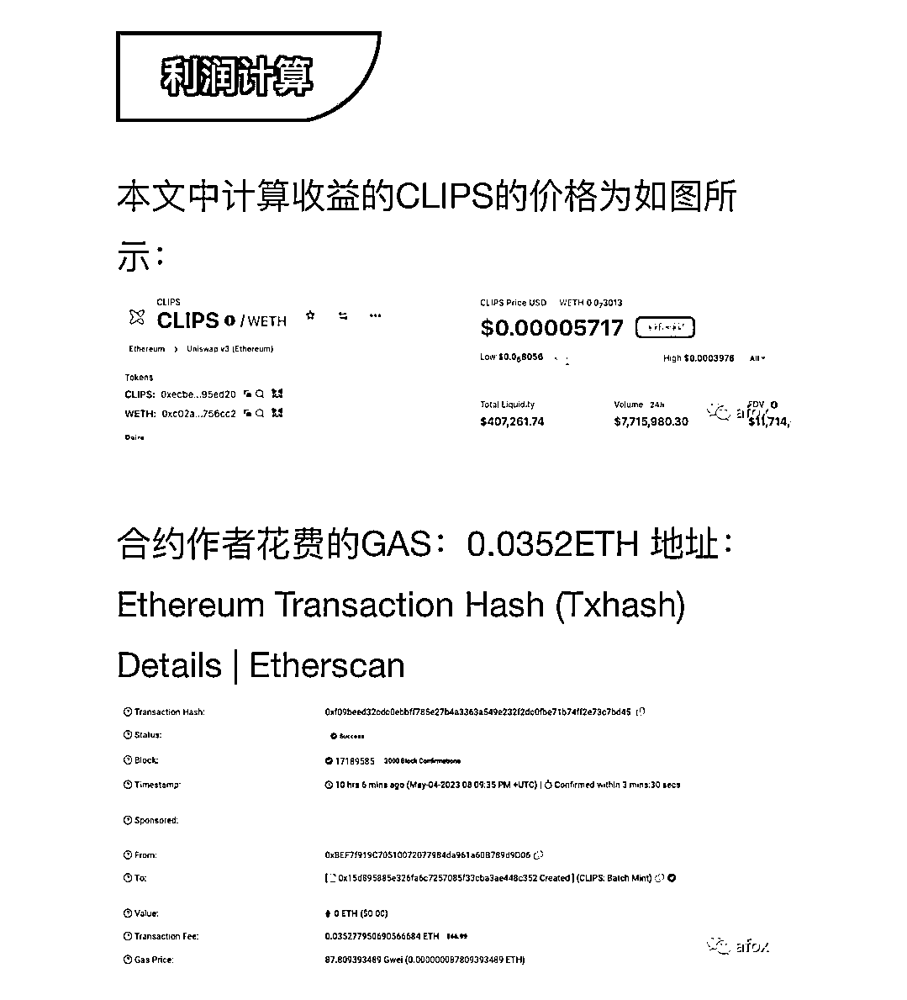

# CLIPS 项目解析：无风险用 0.035eth 十小时轻松赚取 78000U

> 原文：[`www.yuque.com/for_lazy/xkrm14/xpg8gev05vdysksw`](https://www.yuque.com/for_lazy/xkrm14/xpg8gev05vdysksw)

<ne-text id="u9c531d7e">作者： 🐵Sunday🐵</ne-text>

<ne-text id="u927a73fa">日期：2023-05-06</ne-text>

<ne-text id="ufe6b44f1">点赞数：</ne-text><ne-text id="u94a60f15" ne-bold="true">60</ne-text>

<ne-hole id="ub7d76b55" data-lake-id="ub7d76b55"><ne-card data-card-name="hr" data-card-type="block" id="IFnJQ" data-event-boundary="card">

<ne-text id="u7149073b">正文：</ne-text>

<ne-text id="ufc5b5a99">CLIPS 项目解析：无风险用 0.035eth 十小时轻松赚取 78000U 今天比较火的就是 Clips 了，一个类似 xen 的项目，所以玩法应该就是类似</ne-text> <ne-text id="u226a69bd">xen。但是有人另辟蹊径，用批量 mint 的方法赚手续费，而这个是只赚不赔的生意。这篇文章主要来理解一下批量 mint 的基础逻辑。 原文链接🔗：</ne-text> <ne-text id="u35ac01ff">CLIPS 项目解析：无风险用 0.035eth+十小时轻松赚取 78000U <ne-text id="u63173199">pKfCCx6yamw)</ne-text>

<ne-card data-card-name="image" data-card-type="inline" id="cyuWD" data-event-boundary="card"></ne-card>

<ne-hole id="udf637376" data-lake-id="udf637376"><ne-card data-card-name="hr" data-card-type="block" id="YIfPD" data-event-boundary="card">

<ne-text id="u11b5822f">评论区：</ne-text>

<ne-text id="u576d042f">飞向云端 : 虽然看不懂，但是感觉不错</ne-text>

<ne-text id="uc1a6f749">姬小光 : 没池子多少钱也没用[偷笑]</ne-text>

<ne-text id="u7be2dccc">星河 : 这个昨天的了 已经崩了好像</ne-text>

<ne-text id="u0028e54e">竹笋林子 : 看不懂，但感觉很厉害，很想要</ne-text>

<ne-hole id="u0dbcfdfd" data-lake-id="u0dbcfdfd"><ne-card data-card-name="hr" data-card-type="block" id="KR3LN" data-event-boundary="card">

<ne-text id="u821d0646">公众号懒人找资源，懒人专属群分享</ne-text>

</ne-card></ne-hole></ne-card></ne-hole></ne-card></ne-hole>