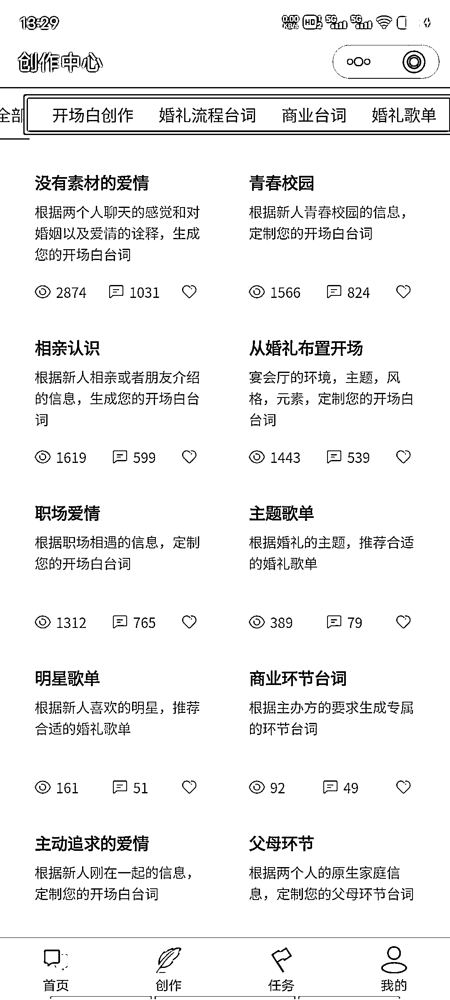

# ChaGPT + 婚礼策划进行小程序开发，细分市场空间巨大

> 原文：[`www.yuque.com/for_lazy/xkrm14/gxz9gt2mh2vgrthh`](https://www.yuque.com/for_lazy/xkrm14/gxz9gt2mh2vgrthh)

作者： 一诺

日期：2023-05-06

点赞数：94

<ne-card data-card-name="hr" data-card-type="block" id="rQNOV" data-event-boundary="card">

正文：

chat gpt +婚礼策划进行小程序开发，细分市场空间巨大 变现方式： ①代写台词 ②会员分销，挣佣金 ③合伙人制，躺赚本地市场红利 由表及里，可以对他行业细化，写论文，写广告……

<ne-card data-card-name="image" data-card-type="inline" id="emtmT" data-event-boundary="card"></ne-card>

<ne-card data-card-name="image" data-card-type="inline" id="srG8b" data-event-boundary="card"></ne-card>

<ne-card data-card-name="hr" data-card-type="block" id="DZs9o" data-event-boundary="card">

评论区：

瓶子 : 第二个图，是啥小程序呀

快印老司机唐应群 : 怎么分销？

高杰 : 都开始做垂类落地项目了[强]

一诺 : 是的，小程序

张英久 : 太牛了[强][强][强]

早早 : 思路一下子打开了呀，第二个图的小程序名字是什么呢？

黄大仙女🧚‍♀️ : 咋弄

<ne-card data-card-name="hr" data-card-type="block" id="SkacR" data-event-boundary="card">

公众号懒人找资源，懒人专属群分享

</ne-card></ne-card></ne-card>