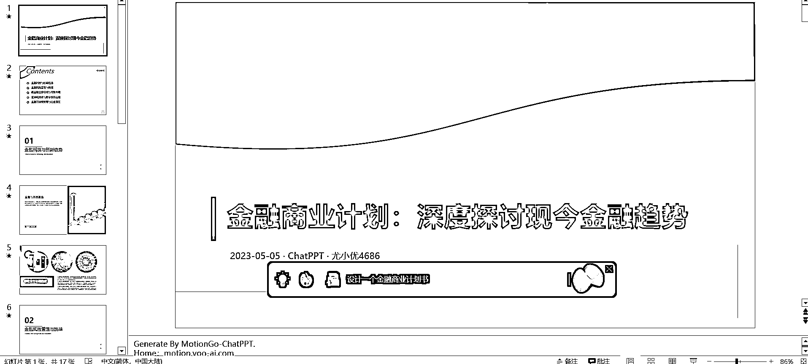
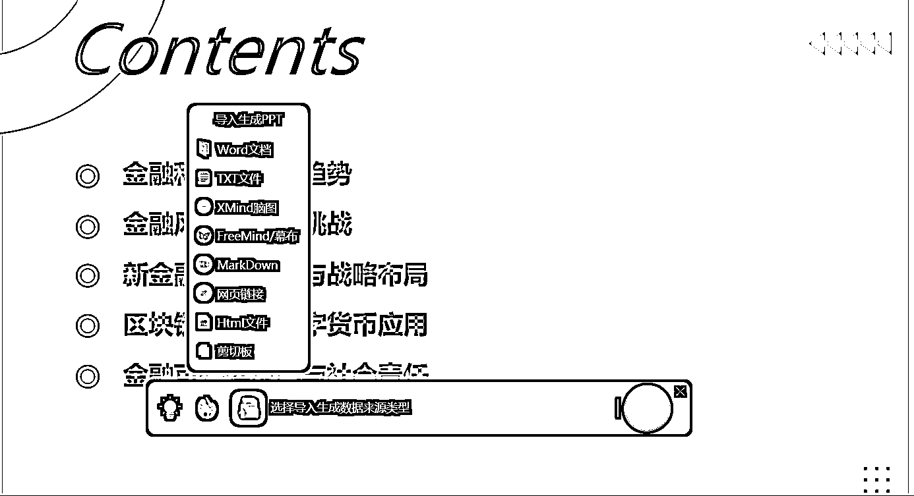
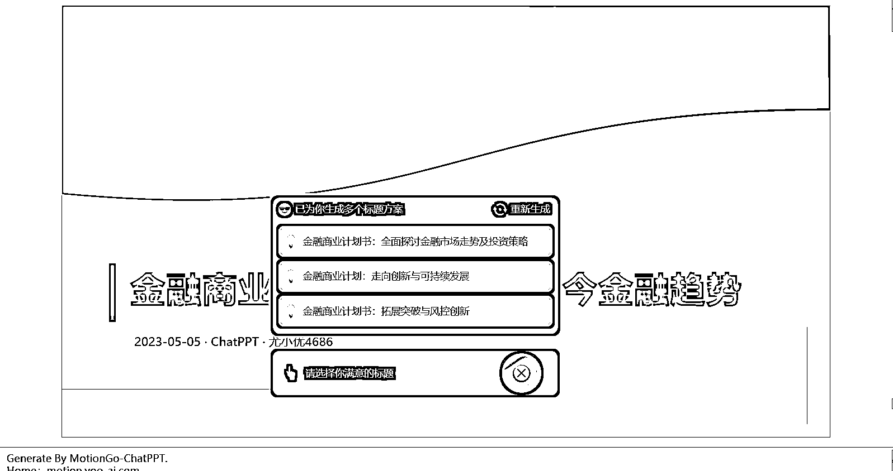
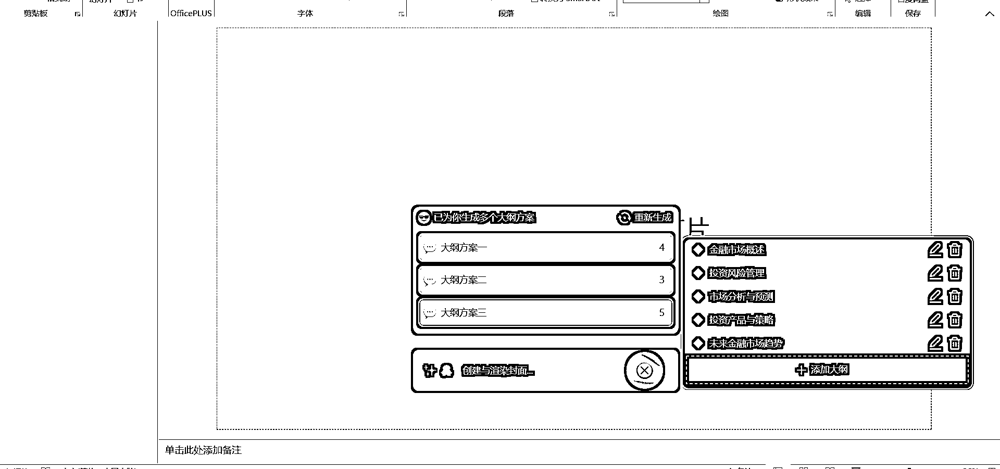

# Ai 一键生成 ppt，不需要去 chatgpt 生成 markdown 格式代码转化了

> 原文：[`www.yuque.com/for_lazy/xkrm14/bgv5gmoxps7iomug`](https://www.yuque.com/for_lazy/xkrm14/bgv5gmoxps7iomug)

作者： 深度思考的瑞克

日期：2023-05-05

点赞数：60

<ne-card data-card-name="hr" data-card-type="block" id="c6vWq" data-event-boundary="card">

正文：

Ai 一键生成 ppt，不需要去 chatgpt 生成 markdown 格式代码再去转化了，现在 motiongo 可以直接输入主题一键生成 ppt，先在官网申请，基本一天就能通过，然后下载插件到 powerpoint，直接就可以使用了 它会先帮你生成几个标题，然后由你进行选择；之后再给出几个可选择大纲的内容，可以添加和删除，之后还会询问你，需要简单、中等、还是深度的内容，最后直接生成一份 ppt；还可以支持各种格式的内容导入后生成 ppt。 之后，我们可以去小红书引流，不管是代做 ppt，商业计划书，或者是培训，都会非常的方便。具体效果如下图

<ne-card data-card-name="image" data-card-type="inline" id="sQdhh" data-event-boundary="card"></ne-card>

<ne-card data-card-name="image" data-card-type="inline" id="i3TJ0" data-event-boundary="card"></ne-card>

<ne-card data-card-name="image" data-card-type="inline" id="vvb9J" data-event-boundary="card"></ne-card>

<ne-card data-card-name="image" data-card-type="inline" id="sO6Ac" data-event-boundary="card"></ne-card>

<ne-card data-card-name="image" data-card-type="inline" id="nnT4j" data-event-boundary="card"></ne-card>

<ne-card data-card-name="hr" data-card-type="block" id="tYM5B" data-event-boundary="card">

评论区：

平凡小吴 : 可以提供一下网址吗。谢谢

朱朱侠 : [MotionGo 官网原 PPT 动画插件口袋动画免费商用 PPT 插件](https://motion.yoo-ai.com/)

深度思考的瑞克 : 感谢感谢

深度思考的瑞克 : 百度直接搜 motiongo 即可

Daydayup : 请教一下，这些自动生成的成果，拿来商用，会不会涉及侵权呢？

深度思考的瑞克 : 只是初稿，还需要改 ppt 布局和部分内容，一般不会涉及到版权

Daydayup : 感谢回复

<ne-card data-card-name="hr" data-card-type="block" id="ubxvx" data-event-boundary="card">

公众号懒人找资源，懒人专属群分享

</ne-card></ne-card></ne-card>