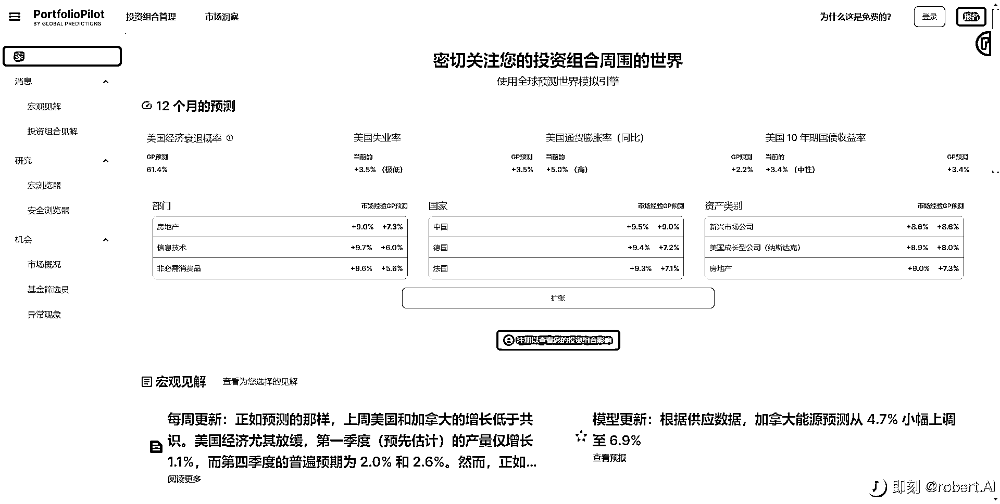

# AI 驱动投资指南

> 原文：[`www.yuque.com/for_lazy/xkrm14/cyiovukxx1f6o2ug`](https://www.yuque.com/for_lazy/xkrm14/cyiovukxx1f6o2ug)

<ne-p id="u679dad5a" data-lake-id="u679dad5a"><ne-text id="u6daddf73">作者： 🐵Sunday🐵</ne-text></ne-p> <ne-p id="u64cbcc31" data-lake-id="u64cbcc31"><ne-text id="ue5e98923">日期：2023-05-05</ne-text></ne-p> <ne-p id="u4c5469bf" data-lake-id="u4c5469bf"><ne-text id="ub34d13b8">点赞数：</ne-text><ne-text id="u0184848a" ne-bold="true">45</ne-text></ne-p> <ne-hole id="u9b1190be" data-lake-id="u9b1190be"><ne-card data-card-name="hr" data-card-type="block" id="RnbZG" data-event-boundary="card"><ne-p id="u4d2cd9cb" data-lake-id="u4d2cd9cb"><ne-text id="u3f9c8df4">正文：</ne-text></ne-p> <ne-p id="u39277451" data-lake-id="u39277451"><ne-text id="u722f6794">AI 驱动投资指南 使用自动投资组合监控、宏观分析和个性化推荐来增加您的资金。</ne-text> <ne-text id="u187e043f">只需复制并粘贴您的投资组合，即可获得对您的投资组合的全面分析，并提供可操作的改进建议、行业和国家/地区细分等。</ne-text> <ne-text id="u129b03a8">发现符合您标准的表现最佳的 ETF 和股票，按费用比率、地理位置、行业等进行过滤。轻松找到您的下一笔投资。</ne-text> <ne-text id="ue7492d6d">随时了解您感兴趣的公司和基金的最新财务信息！获取实时新闻、股票价格、财报电话会议日期、财务概况等。</ne-text> <ne-text id="u0d70645d">及时获取有关美国、加拿大或全球经济的关键宏观见解摘要，保持领先地位。 加入 PortfolioPilot 插件警报邮件列表，监控经济并在机会或风险出现时通知您。</ne-text> <ne-text id="u3f3c179a">PS:注册时需使用电话号码，仅接受美国/加拿大电话号码 Web：</ne-text> [<ne-text id="u251f9428">PortfolioPilot</ne-text>](https://portfoliopilot.com/)</ne-p> <ne-p id="ucff4610d" data-lake-id="ucff4610d"><ne-card data-card-name="image" data-card-type="inline" id="q0Tfr" data-event-boundary="card"></ne-card></ne-p> <ne-p id="u5fedd354" data-lake-id="u5fedd354"><ne-card data-card-name="image" data-card-type="inline" id="N5Jap" data-event-boundary="card"></ne-card></ne-p> <ne-hole id="ue2cab936" data-lake-id="ue2cab936"><ne-card data-card-name="hr" data-card-type="block" id="LnH29" data-event-boundary="card"><ne-p id="uabde6968" data-lake-id="uabde6968"><ne-text id="udd92cf98">评论区：</ne-text></ne-p> <ne-hole id="u7c7e1fab" data-lake-id="u7c7e1fab"><ne-card data-card-name="hr" data-card-type="block" id="yt6eD" data-event-boundary="card"><ne-p id="u9f20181c" data-lake-id="u9f20181c"><ne-text id="u5bba7e2e">公众号懒人找资源，懒人专属群分享</ne-text></ne-p></ne-card></ne-hole></ne-card></ne-hole></ne-card></ne-hole>