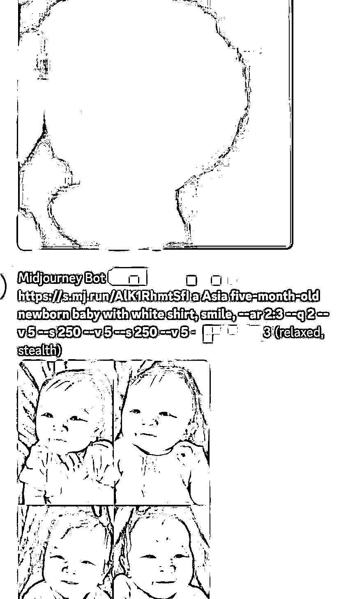
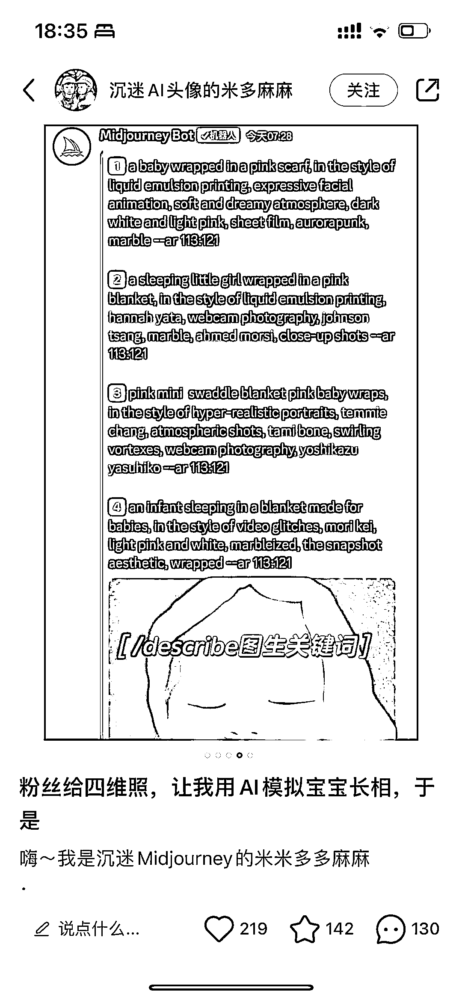

# 四维彩超结合 ai 生成未来宝宝照片，最近比较火

> 原文：[`www.yuque.com/for_lazy/xkrm14/agqd05nwgzrgqww8`](https://www.yuque.com/for_lazy/xkrm14/agqd05nwgzrgqww8)

作者： 马克图布

日期：2023-05-04

点赞数：82

正文：

四维彩超结合 ai 生成未来宝宝照片，最近比较火，有的人还卖教程，收徒 2000➕一个。 附上教程吧，不小心刷到了哈哈哈，咒语都有了。怒赚 2000

评论区：

W.Z.Y : 怎么弄的 看不是很懂

豆豆 : 哈哈哈哈哈哈哈

豆豆 : 圈友优秀

少儿探索科学实验室 : 棒

阿釘。 : 为什么所有人都要截我的账号，不跟我说一声呢😂

佳娜 : 可能不知道这是你的账号？

珑珑 laraine : 太可爱了，当妈的都体会过那迫不及待的心情，就该你赚钱

公众号懒人找资源，懒人专属群分享

