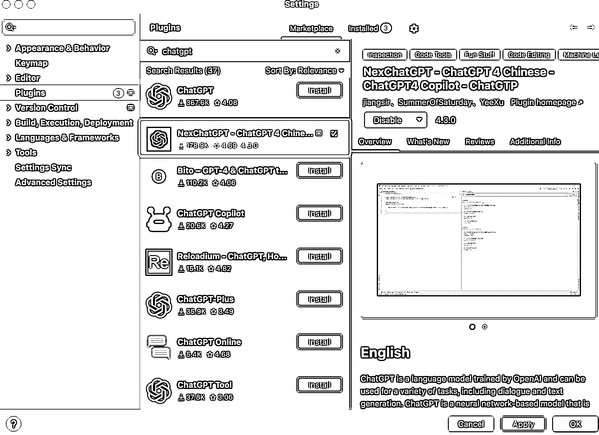

# 市面上有很多提升编码效率的 AI 工具，技术从业者是个好机会

> 原文：[`www.yuque.com/for_lazy/xkrm14/ib0847f4ehag2qdt`](https://www.yuque.com/for_lazy/xkrm14/ib0847f4ehag2qdt)

作者： 一瓶香菇酱

日期：2023-05-04

点赞数：76

<ne-card data-card-name="hr" data-card-type="block" id="LQWJY" data-event-boundary="card">

正文：

#风向标 市面上有很多提升编码效率的 AI 工具，目前该赛道门槛较高，懂技术会编程，但是一旦产品做好之后市场反应非常不错。 体验了几款，不管从安装量和体验效果来看，确实很牛，技术从业者是个好机会。

<ne-card data-card-name="image" data-card-type="inline" id="zXlW9" data-event-boundary="card"></ne-card>

<ne-card data-card-name="image" data-card-type="inline" id="HC7UI" data-event-boundary="card"></ne-card>

<ne-card data-card-name="hr" data-card-type="block" id="wOrOt" data-event-boundary="card">

评论区：

一瓶香菇酱 : idea 开发插件里，nexchatgpt 做的不错，有十几万的安装量

姬小光 : 单独用 cursor 也可以，输入 openai key

一瓶香菇酱 : 嗯 类似的工具有很多，功能体验完善的，有竞争力。apikey 很多人搞不到，要买

姬小光 : 这个 nex 肯定是搞了 2500 刀账户的[坏笑]

一瓶香菇酱 : 不然十几万的安装量，token 消耗太快了

苓枫 : 我天天都在用这个，居然才发现 idea 也能安装 chatgpt 插件

一瓶香菇酱 : 对呀，赶快用起来吧，对于程序员来说真的是效率利器~[悠闲]

<ne-card data-card-name="hr" data-card-type="block" id="p58Tb" data-event-boundary="card">

公众号懒人找资源，懒人专属群分享

</ne-card></ne-card></ne-card>