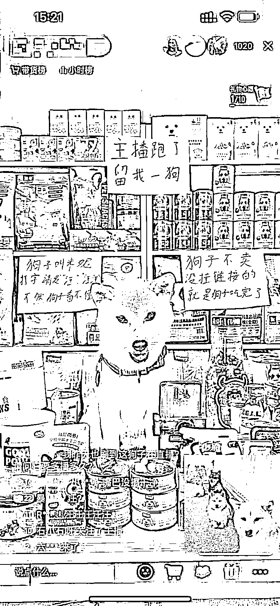

# 抖音差异化直播间， 利用特定场景和特定道具去卖适合产品

> 原文：[`www.yuque.com/for_lazy/xkrm14/cgusbp3qxdwppy35`](https://www.yuque.com/for_lazy/xkrm14/cgusbp3qxdwppy35)

<ne-p id="u479fa948" data-lake-id="u479fa948"><ne-text id="u5820a922">作者： 小振哥</ne-text></ne-p> <ne-p id="u35be883a" data-lake-id="u35be883a"><ne-text id="u38cc1c73">日期：2023-05-11</ne-text></ne-p> <ne-p id="u3f8e04a6" data-lake-id="u3f8e04a6"><ne-text id="u28ba00e5">点赞数：</ne-text><ne-text id="u32c64627" ne-bold="true">114</ne-text></ne-p> <ne-hole id="u97ca34b5" data-lake-id="u97ca34b5"><ne-card data-card-name="hr" data-card-type="block" id="CT4LJ" data-event-boundary="card"><ne-p id="u337baace" data-lake-id="u337baace"><ne-text id="ua740949a">正文：</ne-text></ne-p> <ne-p id="u6c04c947" data-lake-id="u6c04c947"><ne-text id="u817c9869">打造差异化直播间， 利用特定的场景，和特定的道具，去卖适合产品。</ne-text> <ne-text id="u1a075679">从画面上这个已经具备了人货场三个点，只不过这个时候狗来代替了人，利用道具也就是 A4 的文案去吸引大家做一个停留，产品主要是卖狗粮以及跟狗相关的产品。能进到这种直播间的人大多数都是喜欢狗和已经养狗的人了，这个时候只需要后台不断的弹窗做好商品的曝光，爆单是很容易的。</ne-text> <ne-text id="u10fb2445">我这边也是做直播带货的，以我对这个直播间的判断，这个直播间单场销售额会在 5-20w 之间。</ne-text> <ne-text id="ue946d4e1">想要带货的朋友们，可以尝试一下这个模式，比如动物可以换成猫，或者其他的宠物，场景布局个品，自己这个动物一定要做有关联的，这样的流量就会比较精准，后面成交就是一件很容易的事情</ne-text></ne-p> <ne-p id="u291f4081" data-lake-id="u291f4081"><ne-card data-card-name="image" data-card-type="inline" id="z5gQa" data-event-boundary="card"></ne-card></ne-p> <ne-hole id="ua8a5932e" data-lake-id="ua8a5932e"><ne-card data-card-name="hr" data-card-type="block" id="Rdh5G" data-event-boundary="card"><ne-p id="ue13314b4" data-lake-id="ue13314b4"><ne-text id="ufe91ee4b">评论区：</ne-text></ne-p> <ne-p id="u3b133179" data-lake-id="u3b133179"><ne-text id="u9db07290">万能神 : 秒</ne-text></ne-p> <ne-p id="ub507d262" data-lake-id="ub507d262"><ne-text id="u237697b8">施公子 : 哈哈哈😄</ne-text></ne-p> <ne-p id="uebad8ef4" data-lake-id="uebad8ef4"><ne-text id="u8877886f">陈真 : 右下角是连线的嘉宾吗？</ne-text></ne-p> <ne-p id="uac6ae81f" data-lake-id="uac6ae81f"><ne-text id="u25a8a6e7">小振哥 : 不是哦，那个是人家的商品弹窗</ne-text></ne-p> <ne-p id="u42ba092c" data-lake-id="u42ba092c"><ne-text id="ua9185868">乌龙茶 : 半年之前看到过类似的，他们还做了一个机器，观众送礼会由机器投喂狗粮</ne-text></ne-p> <ne-p id="u291f4e6f" data-lake-id="u291f4e6f"><ne-text id="ud6a157cb">北辰 : 完美的狗货场[偷笑]</ne-text></ne-p> <ne-p id="u8b2f8437" data-lake-id="u8b2f8437"><ne-text id="u7f63cdb6">+龙 : 这叫无人直播吗[呲牙]</ne-text></ne-p> <ne-hole id="u669eed41" data-lake-id="u669eed41"><ne-card data-card-name="hr" data-card-type="block" id="mLHbK" data-event-boundary="card"><ne-p id="u9d00baf1" data-lake-id="u9d00baf1"><ne-text id="u1aec4702">公众号懒人找资源，懒人专属群分享</ne-text></ne-p></ne-card></ne-hole></ne-card></ne-hole></ne-card></ne-hole>