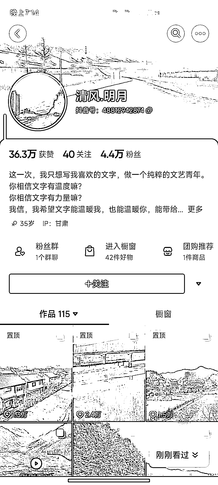
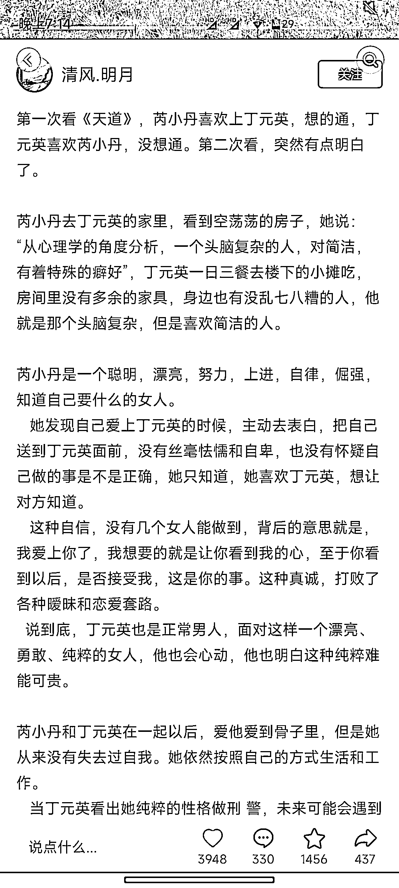
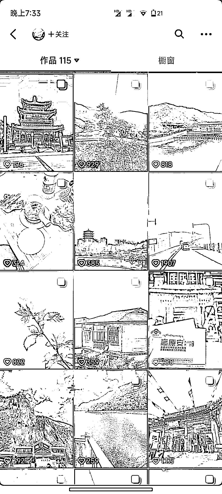

# 抖音图片+长文案账号 4 万多粉，门槛低流量好

> 原文：[`www.yuque.com/for_lazy/xkrm14/qhqd93t2t2lgmwmp`](https://www.yuque.com/for_lazy/xkrm14/qhqd93t2t2lgmwmp)

作者： 阿丰

日期：2023-05-11

点赞数：125

正文：

抖音图文写长文涨粉 这个账号 4 万多粉，内容都是图片➕长文案，图片质量一般，都是普通人拍的风景图，点赞和涨粉都来自于他的文案，他写的是几百上千字的长文案。 公众号作者可以借鉴这种形式，配图➕长文案，涨粉嘎嘎猛(其实就是文案号，但是门槛最低，不用作图和拍视频，流量还很好)。

评论区：

天道酬勤 : 我看了，文案和内容好像没有关系

怡成 : 属于在抖音上喜欢看长文的一类人？

阿丰 : 说句题外话，抖音的内容是全类型内容：图文、长文、短文、视频、直播。

星空 : 这个也会考察停留数据吗

孟大富 : 变现方式有哪些

尺子白 : 看到 天道 两个字就想吐了[捂脸] 很多都没看懂 纯吹 借机割韭菜。

生财王子 : 抖音玄机真多

公众号懒人找资源，懒人专属群分享

