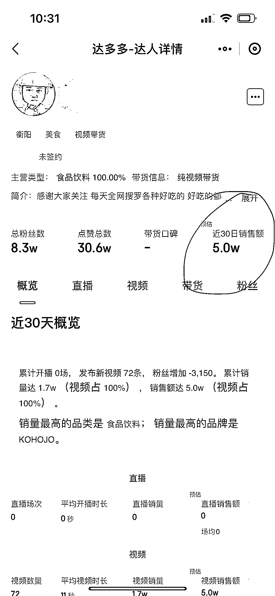

# 抖音低价零食带货，疯狂怼视频的形式，销售额五月份预计 5W

> 原文：[`www.yuque.com/for_lazy/xkrm14/urzd9uk163w0w2qk`](https://www.yuque.com/for_lazy/xkrm14/urzd9uk163w0w2qk)

作者： 蓝大虎

日期：2023-05-11

点赞数：94

正文：

低价零食带货，五月初发布的视频，看视频基本没什么流量，基本就是大量的怼视频量，但是进橱窗 1.8W 件，销售额五月份预计 5W 佣金比例大概在 10%-30%之间，最低也有 5000 每月的利润

评论区：

万能神 : 短视频带货

祁磊 : 一点看法，或许不对:带货玩法其实不看什么点赞播放数据的，就看销量。数据低销量高说明精准。

万能神 : 朋友，您的达人详情在哪里看的

蓝大虎 : 达多多

超 : 最近也有朋友做零食类的抖店，不用拍视频的那种，纯搬运过来的零食链接，起号特别快，15 天做到日销售 9000。但是呢利润非常低，不过一个月四五千还是有的。

蓝大虎 : 感谢分享

公众号懒人找资源，懒人专属群分享

