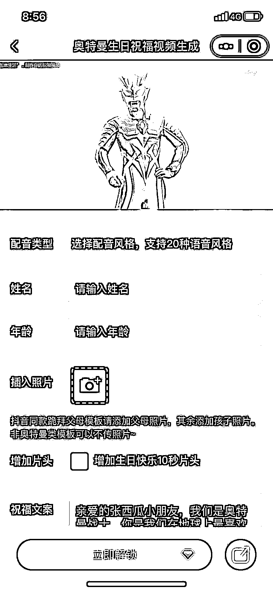
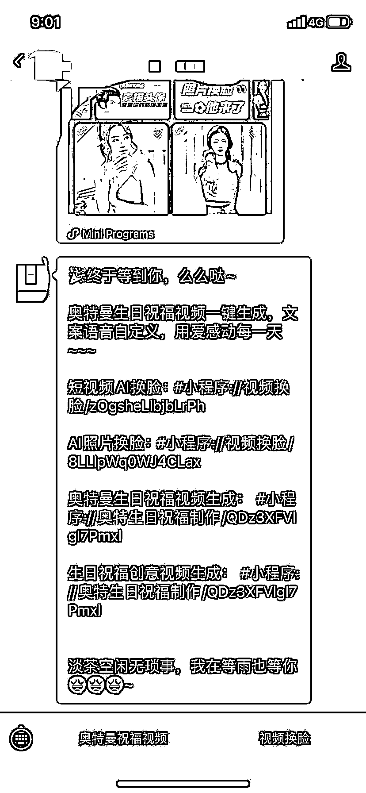

# 奥特曼生日祝福视频这种定制类的同理也可以弄小程序

> 原文：[`www.yuque.com/for_lazy/xkrm14/vnp1zbsoghygtnfg`](https://www.yuque.com/for_lazy/xkrm14/vnp1zbsoghygtnfg)

作者： 北纬 64 度

日期：2023-05-10

点赞数：84

正文：

奥特曼生日祝福视频，有大佬都开发出来小程序了，当然付费制作，一个视频二十几元，输入姓名，年龄，还有一张照片就行。 其它的这种定制类的同理也可以弄小程序

评论区：

南山月 : 刚才去微信搜了一下，果然有，但风格还是比较少，没有我需要的。我在想，现在准备中考和高考，如果能有一些针对中考高考的祝福鼓劲视频定制，是不是也很有销路。还有像一些影视剧长月烬明很火，我家妞就特别喜欢，如果能有剧中主角对她说生日祝福语，我估计她会乐疯了[呲牙]。

💋李姑娘 : 这个我早就看到了。里面的东西太少了。淘宝的特别多。我咨询了好多家。不教学。不合作

伊晨 : 没错 证明这个很赚钱 如果不赚钱了 商家才会选择合作等等

伊晨 : 不赚钱了才会卖课 再收一波韭菜 离场

北纬 64 度 : 感觉难的板块是配音，这个它也不用对口型，视频素材还行。

北纬 64 度 : 确实，我之前也淘宝看了下找了，连卖素材的也少。这个其实也不难，星球里有分享过其它视频的教程，主要的点还是奥特曼的声音，还没发现合适的配音软件。

eason. : 哈哈哈圈友有人会吗

公众号懒人找资源，懒人专属群分享

