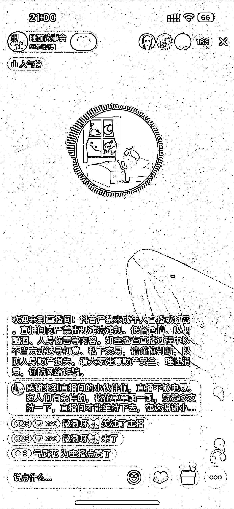
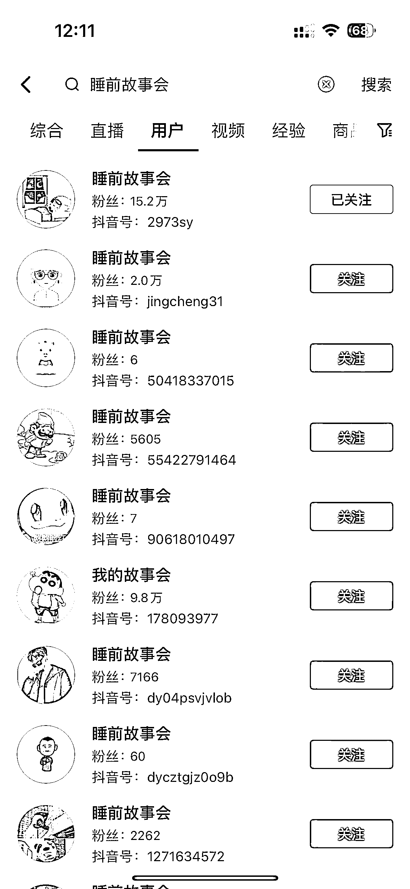
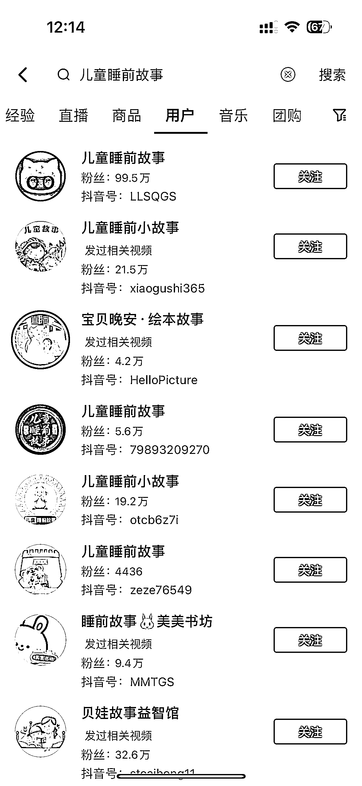
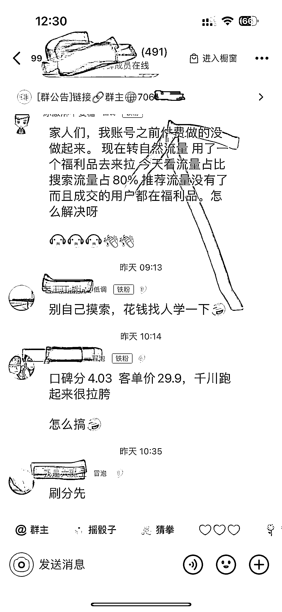

# 抖音少儿睡前故事直播每天平均有 10w 场观，10w 的免费流量

> 原文：[`www.yuque.com/for_lazy/xkrm14/gv7y7y3lygnuyg5y`](https://www.yuque.com/for_lazy/xkrm14/gv7y7y3lygnuyg5y)

作者： 元彻

日期：2023-05-08

点赞数：65

<ne-hole id="u5ec12107" data-lake-id="u5ec12107"><ne-card data-card-name="hr" data-card-type="block" id="c49Up" data-event-boundary="card">

正文：

刷到一个细分赛道的电台直播，播放的是一些几岁小朋友的睡前故事，每天挂着涨粉，人群都是年轻宝妈，抖音的消费主力军。 这个号直播间每天平均有 10w 场观，10w 的免费流量，10w 的精准宝妈粉，可以建粉丝群，直播画面放文字贴纸或者头像改成一个钩子信息（例如进粉丝群送育儿电子书，儿童绘本等等）再在群公告发布自己的联系方式进行相关私域引流 看了几个类似的账号引流变现手段还有很大优化空间，感觉这块还有机会超越对手。 引流

<ne-card data-card-name="image" data-card-type="inline" id="Uqcu4" data-event-boundary="card"></ne-card>

<ne-card data-card-name="image" data-card-type="inline" id="Qxnyv" data-event-boundary="card"></ne-card>

<ne-card data-card-name="image" data-card-type="inline" id="ise0X" data-event-boundary="card"></ne-card>

<ne-card data-card-name="image" data-card-type="inline" id="u4Wny" data-event-boundary="card"></ne-card>

<ne-card data-card-name="image" data-card-type="inline" id="z97w0" data-event-boundary="card"></ne-card>

<ne-card data-card-name="image" data-card-type="inline" id="tMrIa" data-event-boundary="card"></ne-card>

<ne-hole id="u7c2debe7" data-lake-id="u7c2debe7"><ne-card data-card-name="hr" data-card-type="block" id="aEBzg" data-event-boundary="card">

评论区：

梁有鱼🐟 : 想问问，你图 3 的数据是哪个平台查看的？

元彻 : 考古加 [兴趣电商数据专家-考古加数据](https://www.kaogujia.com/)

梁有鱼🐟 : 谢谢[抱拳]

元彻 : 不客气[憨笑]

周宇 : 这个思路太棒了

元彻 : 谢谢亦仁大大

<ne-hole id="u507f47c2" data-lake-id="u507f47c2"><ne-card data-card-name="hr" data-card-type="block" id="cHQ9L" data-event-boundary="card">

公众号懒人找资源，懒人专属群分享

</ne-card></ne-hole></ne-card></ne-hole></ne-card></ne-hole>