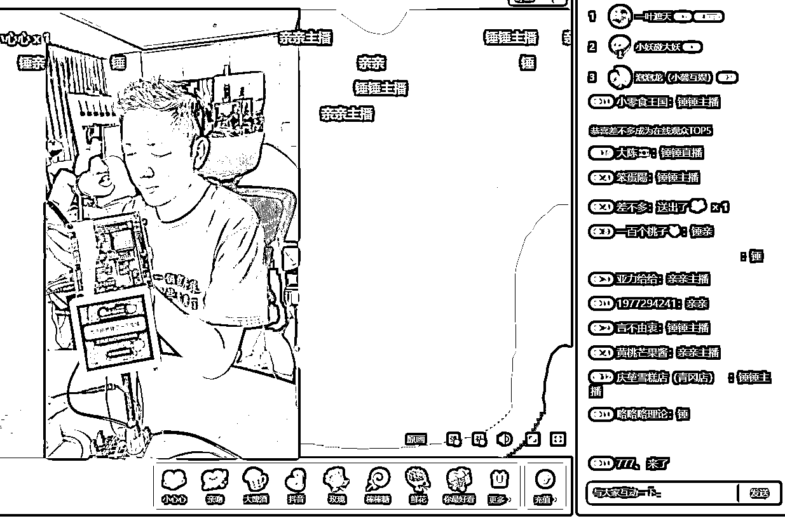

# 礼物互动道具，每天没事直播一下，互动高

> 原文：[`www.yuque.com/for_lazy/xkrm14/qrrys5u2gmk9fzvy`](https://www.yuque.com/for_lazy/xkrm14/qrrys5u2gmk9fzvy)

作者： 钱劲

日期：2023-05-05

点赞数：48

正文：

程序员做了一个礼物互动道具，会拍打跟亲亲，每天没事直播一下，互动高，能带动刷礼物

评论区：

字节叔叔 : 整理下思路： 1、spider 实时抓取直播间的评论数据； 2、检测到用户发了“亲亲”或“锤锤”字眼，控制设备做出相应的动作。 要求： 1、需要有能够抓直播间评论区数据的 spider； 2、需要物理设备，能够根据指令做出亲亲和锤锤的动作（单片机？数控设备？） 风险： 1、抓取直播间评论区数据是否合规？ 其他： 是否可以丰富其他场景或动作？比如让设备唱歌（参考扭来扭去的仙人掌）、跳舞、讲段子等。

大勇非勇 : 这个真大有搞头，我随便设想一下，搞个可以砸金蛋的机械臂，刷礼物砸蛋开奖

公众号懒人找资源，懒人专属群分享

