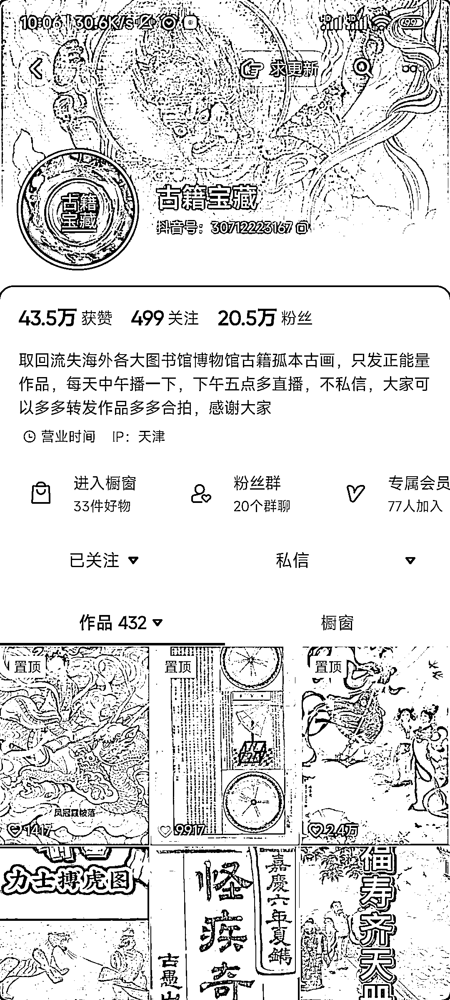
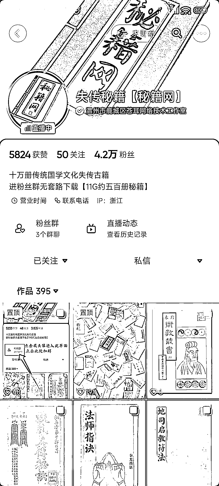
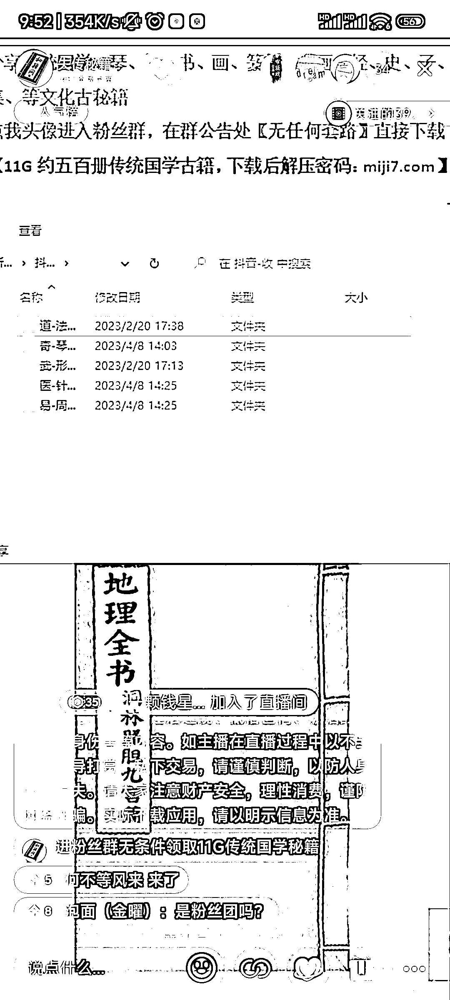

# 抖音设置粉丝群进群条件免费分享古籍等资料的直播模式，其他也可以参考

> 原文：[`www.yuque.com/for_lazy/xkrm14/mzfvmg8b4flo1t10`](https://www.yuque.com/for_lazy/xkrm14/mzfvmg8b4flo1t10)

作者： 昌昌

日期：2023-05-04

点赞数：25

正文：

最近在抖音刷直播遇到这种的直播模式，设置粉丝群进群条件免费分享古籍等资料，要求粉丝团等级 3 级才可以进群或者免费加粉丝团进群领取网盘资料，用古籍、书法绝本等来引流，精准粉丝多涨粉快，其他依靠资料或者书籍学习的行业是不是也可以这样引流。 引流 涨粉

  

  

  

  

评论区：

忘川 : 这些古籍的来源是在哪呢？

昌昌 : 应该可以在网上找或者找渠道购买

楓之語 : 书格网 古籍不少[书格](https://new.shuge.org/)

公众号懒人找资源，懒人专属群分享

