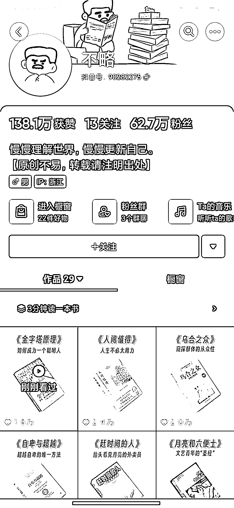

# 抖音通过拆解一本本书来吸引用户的书单号，基本都是过万播放量

> 原文：[`www.yuque.com/for_lazy/xkrm14/gc5mscr5zqe7nrar`](https://www.yuque.com/for_lazy/xkrm14/gc5mscr5zqe7nrar)

作者： 暮夜微暖夏亦凉🍀

日期：2023-05-04

点赞数：62

正文：

最近看到一个抖音书单号，通过拆解一本本书来吸引用户，从今年 2 月份开始到现在基本上每个视频都有过万的播放量，同时也出了很多订单

  

评论区：

傲娇的大刚 : 这个画是他自己画的么

老虎 : 也在关注，粉丝涨的很猛

witon : 是的 博主自己画的 声音也是自己的

lalalaLiz : 把听书做成“看”书

57℃冰可乐 : 不是过万的播放量，是过万的点赞量，视频平均播放量应有 40w 左右

公众号懒人找资源，懒人专属群分享

</ne-p>