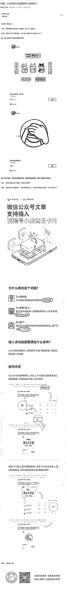

# 公众号可以插入视频号小店商品卡片，可以做开通橱窗业务，利润大

> 原文：[`www.yuque.com/for_lazy/xkrm14/gvn7iesq8b9u14xg`](https://www.yuque.com/for_lazy/xkrm14/gvn7iesq8b9u14xg)

<ne-text id="u3981b9a5">作者： 常常</ne-text>

<ne-text id="u6e8669db">日期：2023-05-11</ne-text>

<ne-text id="ud3a526fe">点赞数：</ne-text><ne-text id="u2355c3ec" ne-bold="true">76</ne-text>

<ne-hole id="u64e8ae41" data-lake-id="u64e8ae41"><ne-card data-card-name="hr" data-card-type="block" id="zsB0V" data-event-boundary="card">

<ne-text id="ua46884f5">正文：</ne-text>

<ne-text id="ucf19d62f">微信公众号新动作，帮助博主打通带货的最后一步 微信公众号文章里面，可以插入视频号小店商品卡片了 这里存在着一个信息差：</ne-text> <ne-text id="u04957ab1">需要视频号开通商品橱窗的功能，视频号开通橱窗功能，需要有效关注人数（粉丝） 1000</ne-text> <ne-text id="u0e10a17e">人及以上，这个条件会卡住很多一部分人，如果有相关资源可以快速帮助别人开通橱窗，可以吃到利润。</ne-text> <ne-text id="ub1b357a0">公众号绑定视频号，且视频号开通“商品橱窗”功能后，即可接入该功能 To 创作者： 可以更好地帮助创作者变现，获取回报 To 商家/达人：</ne-text> <ne-text id="u46370367">直达创作者粉丝，拓展商家和达人带货渠道，提升转化效率 To 用户： 视频号小店拥有更好的原生购物体验，用户可以放心“买买买</ne-text>

<ne-card data-card-name="image" data-card-type="inline" id="chf88" data-event-boundary="card"></ne-card>

<ne-hole id="u31b85a79" data-lake-id="u31b85a79"><ne-card data-card-name="hr" data-card-type="block" id="huxlq" data-event-boundary="card">

<ne-text id="ucf55e200">评论区：</ne-text>

<ne-text id="u5f24e4e7">天道电商-东东 : 刚想发[捂脸]</ne-text>

<ne-text id="u89c305a9">杜永旺 : 发了，删了</ne-text>

<ne-text id="u3f1c447e">常常 : 哈哈，说明我们都看好微信公众号带货的未来[偷笑]</ne-text>

<ne-text id="u919cd1d1">常常 : [捂脸]</ne-text>

<ne-text id="u80a2ba9c">在路上 : 宇宙的尽头是带货</ne-text>

<ne-hole id="ue5c14fee" data-lake-id="ue5c14fee"><ne-card data-card-name="hr" data-card-type="block" id="SNbpK" data-event-boundary="card">

<ne-text id="u0a8a0dfe">公众号懒人找资源，懒人专属群分享</ne-text>

</ne-card></ne-hole></ne-card></ne-hole></ne-card></ne-hole>