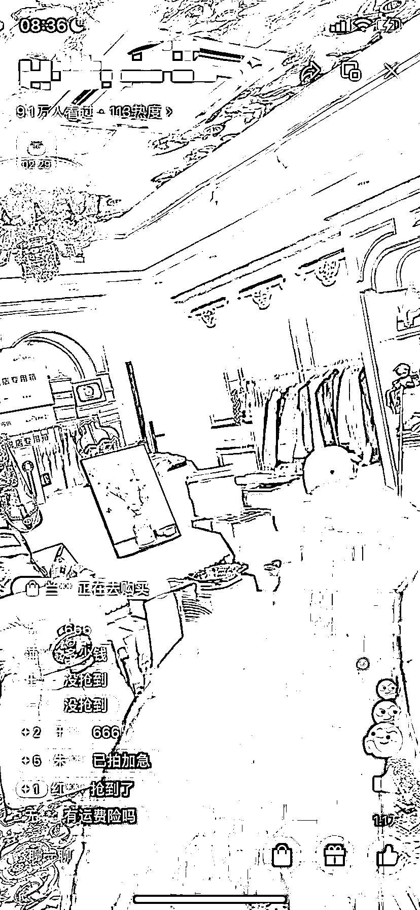

# 视频号 1W+ 热度爆款带货直播逻辑

> 原文：[`www.yuque.com/for_lazy/xkrm14/lu8oo2fb3uwt4q2v`](https://www.yuque.com/for_lazy/xkrm14/lu8oo2fb3uwt4q2v)

作者： eason.

日期：2023-05-10

点赞数：58

<ne-hole id="u9551fb96" data-lake-id="u9551fb96"><ne-card data-card-name="hr" data-card-type="block" id="qXlQS" data-event-boundary="card">

正文：

视频号 1W+热度爆款带货直播逻辑： 我观察了 3 天了，最近开始刷到越来越多这样的带货直播间 【打法核心】：处处戳人性，自古套路得人心 1 以外国进出捡漏，尾货清仓为噱头 2 名字、场景布置符合人设 3 直播脚本套路很深，从人员配合》人设建立》极其精细化的时间切分促单》整体内容框架搭建看的叹为观止 【推荐】 1 有供应链能力的尝试看能不能直接供货，预计会有很多模仿的博主（目前看到都是带现有店铺的货） 2 有直播条件的直接上，我看到的几个直播间一天卖 1w+的货 我已经扒下来了，大家感兴趣留言，空了梳理一下发个文，我自己也感兴趣，但是没经验，推荐里写到能力吻合的伙伴期待沟通[憨笑]

<ne-card data-card-name="image" data-card-type="inline" id="IctN9" data-event-boundary="card">  <ne-p id="udec5e163" data-lake-id="udec5e163"><ne-card data-card-name="image" data-card-type="inline" id="pCnf0" data-event-boundary="card">  <ne-p id="u75bd54c2" data-lake-id="u75bd54c2"><ne-card data-card-name="image" data-card-type="inline" id="Z5dZQ" data-event-boundary="card">  <ne-hole id="uc7250e0b" data-lake-id="uc7250e0b"><ne-card data-card-name="hr" data-card-type="block" id="T07Vh" data-event-boundary="card"><ne-p id="ue595b9ae" data-lake-id="ue595b9ae">评论区：

闫君 : 这个好

王 : Mark，坐等

<ne-hole id="ucd8df7f8" data-lake-id="ucd8df7f8"><ne-card data-card-name="hr" data-card-type="block" id="KIDra" data-event-boundary="card">

公众号懒人找资源，懒人专属群分享

</ne-card></ne-hole></ne-card></ne-hole></ne-card></ne-p></ne-card></ne-p></ne-card></ne-p></ne-card></ne-hole>