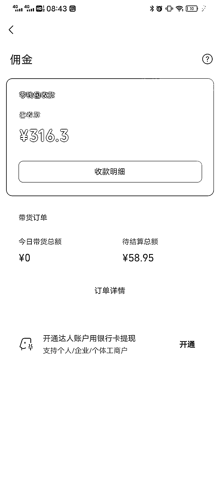

# 微信视频号广告分成，转化率比抖音快手要好

> 原文：[`www.yuque.com/for_lazy/xkrm14/pigz95r3m8uaf6i5`](https://www.yuque.com/for_lazy/xkrm14/pigz95r3m8uaf6i5)

作者： 老吴

日期：2023-05-09

点赞数：71

正文：

测试了一下微信视频号广告分成，做了 3 条科普视频，其中一条 1 分钟视频 5000 多播放获得收益 14 块，做中视频的可以去尝试，同时可以做带货，亲测转化率比抖音快手要好！

  

  

评论区：

zj : 十万的播放，只有三块多的路过

老虎 : 精英日课同学？

彬🤔 : 37 万播放才十块钱，原创度不够原创权益还被禁用几天了[捂脸]

辛禾 : 不是原创一直不敢开原创的路过[捂脸]

公众号懒人找资源，懒人专属群分享

</ne-p></ne-p>