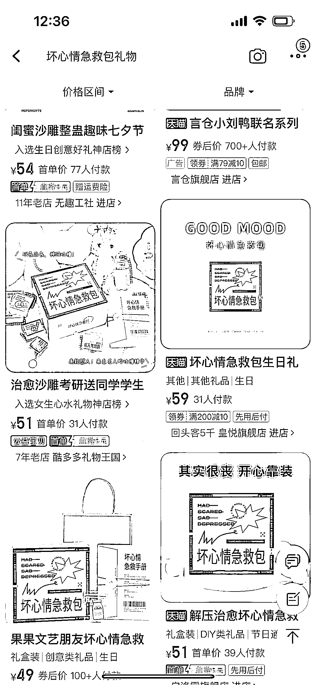

# 坏心情急救包这类文创礼物，卖点很好

> 原文：[`www.yuque.com/for_lazy/xkrm14/uchhtlhnhryl1v1n`](https://www.yuque.com/for_lazy/xkrm14/uchhtlhnhryl1v1n)

作者： 王好同学

日期：2023-05-05

点赞数：72

<ne-hole id="u91db443d" data-lake-id="u91db443d"><ne-card data-card-name="hr" data-card-type="block" id="pwsZK" data-event-boundary="card">

正文：

今天一打开淘宝，让我看到了 坏心情急救包 这个热搜，抱着好奇的心态去搜索了一下，原来是一些文创礼物，但是我觉得这个卖点很好，很符合当下年轻人的需求，还有打工人解压系列产品。 贩卖情绪，可不可以把它拿到小红书⬆️呢，我觉得这有点像开盲盒，解救不开心是内心有一份小小的期待。

<ne-card data-card-name="image" data-card-type="inline" id="uhHoe" data-event-boundary="card"></ne-card>

<ne-card data-card-name="image" data-card-type="inline" id="C7aPH" data-event-boundary="card"></ne-card>

<ne-hole id="u10b27985" data-lake-id="u10b27985"><ne-card data-card-name="hr" data-card-type="block" id="qKZIv" data-event-boundary="card">

评论区：

朱朱侠 : 难道是你最近的心情不好，被大数据察觉到了吗[坏笑]

王好同学 : 哈哈哈哈也许吧

红书 : 感觉这个挺好的

<ne-hole id="u547a7c1d" data-lake-id="u547a7c1d"><ne-card data-card-name="hr" data-card-type="block" id="cxQh8" data-event-boundary="card">

公众号懒人找资源，懒人专属群分享

</ne-card></ne-hole></ne-card></ne-hole></ne-card></ne-hole>