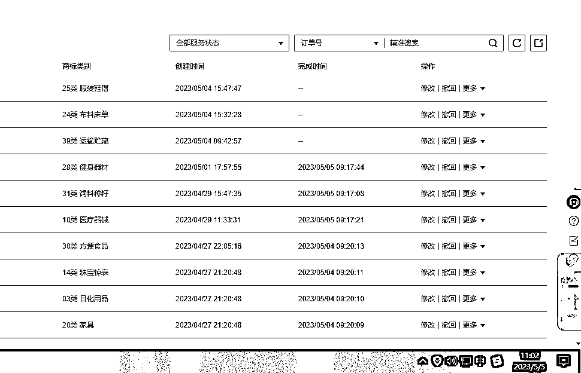
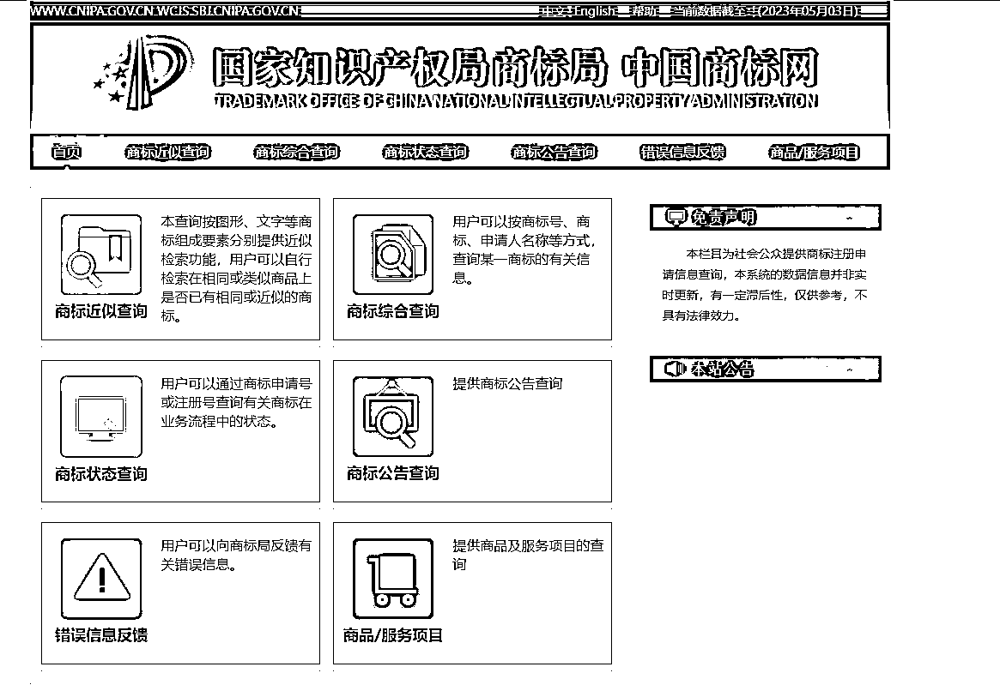

# LOGO 自助设计和商标设计一体化，直接实战出来了

> 原文：[`www.yuque.com/for_lazy/xkrm14/xkahllcdp3wqb5f2`](https://www.yuque.com/for_lazy/xkrm14/xkahllcdp3wqb5f2)

作者： 幻中说焕

日期：2023-05-05

点赞数：48

正文：

LOGO 自助设计和商标设计一体化，外面收费五千块一周回本的教程，直接实战出来了，含接单教程 上个月无意和圈友侠狼老铁聊了这块，后来我深入研究后决定下场干，目前我已经有快五十个了，准备先做到几百上千个商标 一、自己屯商标卖商标 1.注册，商标注册流程不难，在商标网或者第三方阿里云，华为云，百度云都可以注册（第三方操作流程要简单一些节省时间精力），商标名称记得查重，推荐权大师 so.quandashi.com ，然后避开三个坑，近似标，显著性，以及违法商标法。关于字体这块做免费版权的，千万不要碰方正字库的字体。 2.LOGO 设计，这块很重要，我之前都是花六百找 TB 上设计的，现在直接用 MJ 设计出雏形后，然后在用美图二次更改 3.需要准备的，营业执照（个体户或者公司营业执照都行），如果想做个人建议就直接用个体户注册到个人名下，免得二次做变更从法人转到自然人名下又要花一个月时间 4.大量放量，一个商标成本 270,100 个就是 27000,50%-80%的通过率 5.开始收获转卖，商标下来后，直接做地址变更，这样可以避免骚扰，让自己的商标持续议价，一般好的商标少的话赚几十倍，多的话赚几百倍上千倍。 二、低客单价，赚代注册代设计的手工费用，一般一笔可以赚个几百左右，可以在 TB 或许索马里上面开店，然后自己接单做 三、高客单价，在猪八戒或许其他的设计网上，直接注册账号接商单，一般一个商单周期就是一周左右，需要反复沟通磨合客户用户，当然客单价比较高，一个可以赚几千上万不等。 整体步骤都很简单的，操作起来也很容易，有资金量的伙伴适合自己囤，做兼职的伙伴可以做代注册代设计这类，看完记得点赞！（原创写作不易，未经本人同意不要搬运这个帖子到其他平台割韭菜，我很讨厌那种不尊重知识原创者，特别是搬公众号的这块，要是被发现了直接矩阵式打击)

评论区：

太白 : 有问题请教 如何联系圈友

超 : 转卖的话在哪里卖呢？

珍珍 : 什么时候带我们实操一下[微笑]

大块儿橡皮 : 我怎么记得，注册一个最低价一般商标，要 300 块，那要屯个 1000 个，是不得准备 30w 起步？其二，商标不只有图标，更重要是汉字名称，在几十个品类下筛选名称、尝试注册，会需要耗费大量时间，毕竟商标抢注这个业务商标代理公司更专业，也行之多年。不知我说的对不对

AI 同行侠-文卓 : 需要对商标的注册类目很清楚，屯商标盈利空间才更大，270 元对应 10 个注册类目，建议直接对标大品牌的注册类目，找到关键注册类目，盲目注册类目，商标价值低很多。

幻中说焕 : 270

幻中说焕 : 在大型交易平台就可以挂了

公众号懒人找资源，懒人专属群分享

