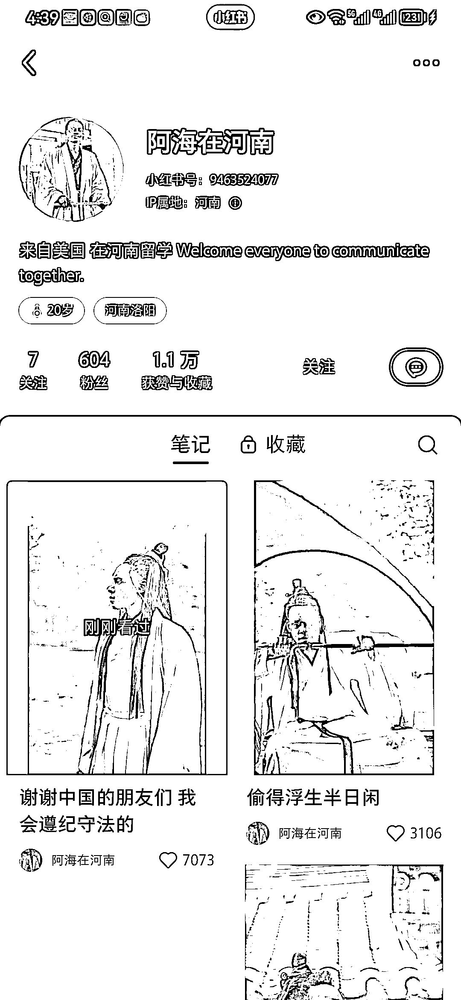

# 小红书，外国人分享在国内的日常，流量很好

> 原文：[`www.yuque.com/for_lazy/xkrm14/gmc6p83ihmxfd0uy`](https://www.yuque.com/for_lazy/xkrm14/gmc6p83ihmxfd0uy)

作者： 河亘

日期：2023-05-12

点赞数：105

<ne-card data-card-name="hr" data-card-type="block" id="V5oLZ" data-event-boundary="card">

正文：

小红书最近很多这样的账号，流量很大

<ne-card data-card-name="image" data-card-type="inline" id="eSsi1" data-event-boundary="card"></ne-card>

<ne-card data-card-name="image" data-card-type="inline" id="v8n65" data-event-boundary="card"></ne-card>

<ne-card data-card-name="hr" data-card-type="block" id="Zuvxg" data-event-boundary="card">

评论区：

小侯的王先生 : 外国人在中国一直都是流量密码[偷笑]

河亘 : 特别是黑人，男女都会去评论一下

剽悍的大春 : 这个怎么在小红书变现？想不明白

在路上 : 抖音上喊妈妈的视频

王 Sir : 打破传统审美[偷笑]这也是异常值

骷比絨 : 这种账号变现模式是什么？ 可以用 ai 生成吗

周彦充 : 哈哈，黑人开始玩小红书了

<ne-card data-card-name="hr" data-card-type="block" id="S6LWw" data-event-boundary="card">

公众号懒人找资源，懒人专属群分享

</ne-card></ne-card></ne-card>