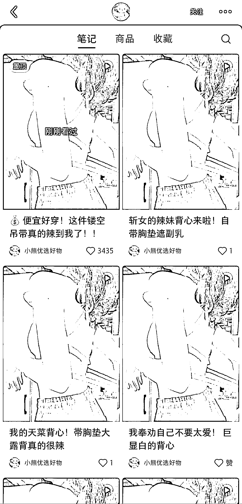

# 小红书笔记只铺一件吊带，换文案和背景音乐，已经卖出 3421 单

> 原文：[`www.yuque.com/for_lazy/xkrm14/xnqp4zyg6ulhexyi`](https://www.yuque.com/for_lazy/xkrm14/xnqp4zyg6ulhexyi)

作者： Alyn 琳儿

日期：2023-05-11

点赞数：163

<ne-hole id="u51134701" data-lake-id="u51134701"><ne-card data-card-name="hr" data-card-type="block" id="IumFG" data-event-boundary="card">

正文：

小红书笔记只铺一件吊带，换文案，换背景音乐，视频呢内容全部一样。 保存图片到拼多多搜索，价格💰8，小红书卖两件 29.9，已经卖出 3421 单，营业额差不多四万多了

<ne-card data-card-name="image" data-card-type="inline" id="kzGwD" data-event-boundary="card"></ne-card>

<ne-card data-card-name="image" data-card-type="inline" id="vU0z0" data-event-boundary="card"></ne-card>

<ne-card data-card-name="image" data-card-type="inline" id="nNUGL" data-event-boundary="card"></ne-card>

<ne-hole id="u4dcaf5a6" data-lake-id="u4dcaf5a6"><ne-card data-card-name="hr" data-card-type="block" id="UuvS9" data-event-boundary="card">

评论区：

蒋蒋蒋蒋 : 她甚至只是混剪素材换音乐[发呆]

Alyn 琳儿 : 对～而且我看第一条笔记 4.29，如果从一条笔记开始卖，到今天半个月的时间四万多，😨😨

伍 Kiki : 是从拼多多进货到小红书卖吗？

万能神 : 4.11

万能神 : 我感觉是不是与他那个热门视频相关，所以出单很厉害，有点运气成分

发生甚么事了 : 我比较好奇，这种走量的单子，是不是只能让货源去发货，自己咋发的过来

陈真 : 有没有 AI 痕迹？这种的你让我一个男人只能混剪！！

<ne-hole id="u7d1dd835" data-lake-id="u7d1dd835"><ne-card data-card-name="hr" data-card-type="block" id="RVq8g" data-event-boundary="card">

公众号懒人找资源，懒人专属群分享

</ne-card></ne-hole></ne-card></ne-hole></ne-card></ne-hole>