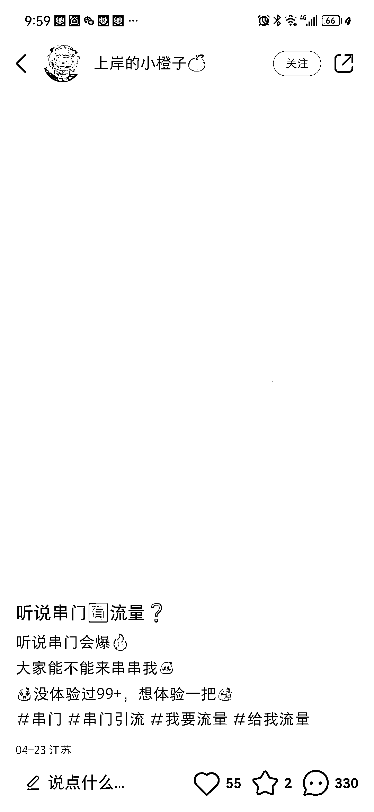
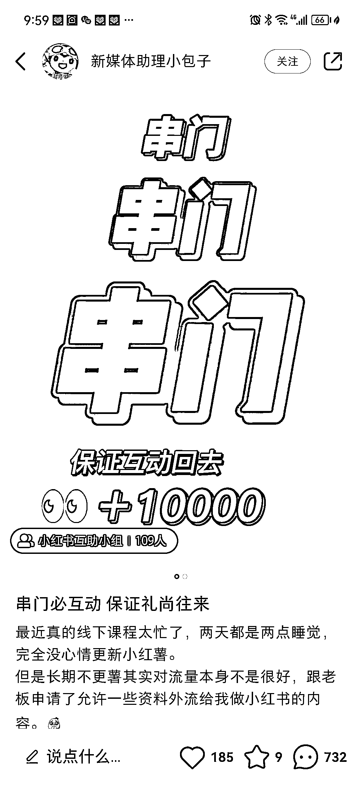

# 小红书串门引流， 流量确实很好

> 原文：[`www.yuque.com/for_lazy/xkrm14/xyg7heb2rgg88hda`](https://www.yuque.com/for_lazy/xkrm14/xyg7heb2rgg88hda)

作者： 九歌

日期：2023-05-10

点赞数：86

<ne-hole id="u27b16724" data-lake-id="u27b16724"><ne-card data-card-name="hr" data-card-type="block" id="B6jJf" data-event-boundary="card">

正文：

小红书串门引流 最近小红书很多串门贴 流量确实很好 主要原因是引导别人在自己评论区留言 然后系统以为你的帖子质量好 然后又推荐给更多的人 可以用来做起号动作

<ne-card data-card-name="image" data-card-type="inline" id="pEnTH" data-event-boundary="card">  <ne-p id="u453e05ef" data-lake-id="u453e05ef"><ne-card data-card-name="image" data-card-type="inline" id="ZFbOC" data-event-boundary="card">  <ne-hole id="u3ca37aa1" data-lake-id="u3ca37aa1"><ne-card data-card-name="hr" data-card-type="block" id="yNEDG" data-event-boundary="card"><ne-p id="ud39d188d" data-lake-id="ud39d188d">评论区：

飞鸡壳壳 : 我就是这样做的，涨粉利器，还顺便提高了以前的阅读量

西成歌 : 这样对粉丝画像有影响吗？

<ne-hole id="u8926df2a" data-lake-id="u8926df2a"><ne-card data-card-name="hr" data-card-type="block" id="Zt3sa" data-event-boundary="card">

公众号懒人找资源，懒人专属群分享

</ne-card></ne-hole></ne-card></ne-hole></ne-card></ne-p></ne-card></ne-p></ne-card></ne-hole>