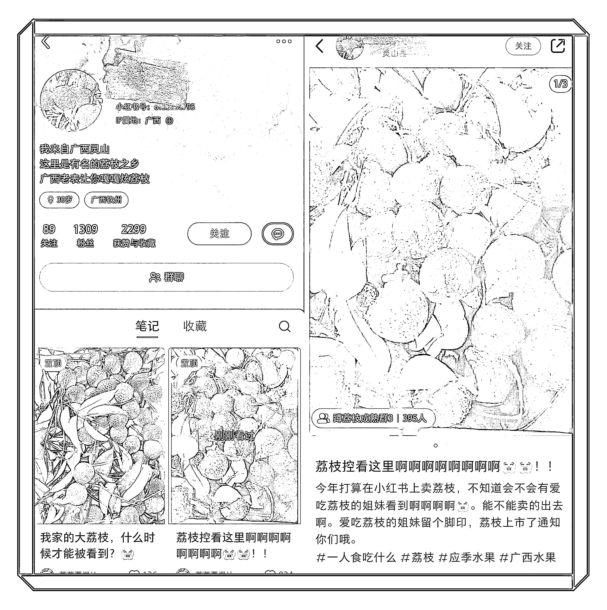
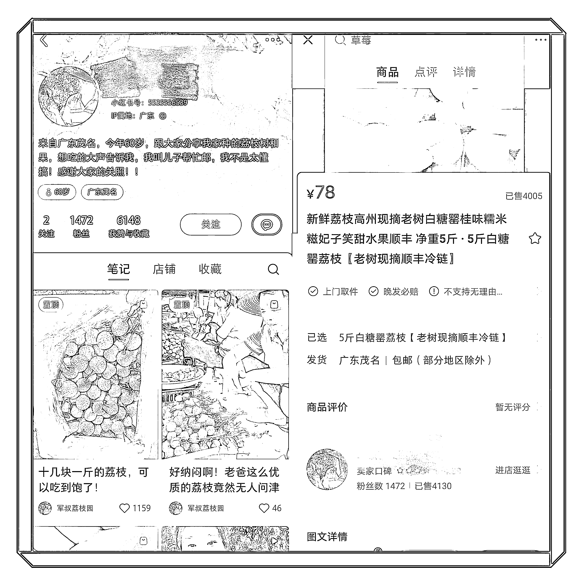

# 小红书卖水果，仅有千粉销量都已经达到 4000 左右

> 原文：[`www.yuque.com/for_lazy/xkrm14/isck2d1crp0xmkcb`](https://www.yuque.com/for_lazy/xkrm14/isck2d1crp0xmkcb)

作者： 陆哲超

日期：2023-05-09

点赞数：130

<ne-hole id="ud525dfa6" data-lake-id="ud525dfa6"><ne-card data-card-name="hr" data-card-type="block" id="XksZE" data-event-boundary="card">

正文：

看一下这两个小红书买水果的帐号，都是非常厉害的帐号，非常直接学习和落地，都只有千粉，5000 左右的赞藏，荔枝的两个帐号都是 5 月份才发的第一条笔记，起号非常快，同时销量都已经达到 4000 左右。第一个帐号采用进群方式，目前已经第四个群了，第二个帐号是采用预售模式，已经预售了 4000 多单。 直接是小红书店铺卖货，而且是预售模式，可以拿着订单去找供应链和渠道； 抓住流量红利，优先抢跑，顺势而为，目前荔枝还没有上市，做这类帐号的同行肯定少，竞争少，优先发力，能获取更多的流量。水果都是季节性的，都可以采用这种方式；

<ne-card data-card-name="image" data-card-type="inline" id="bsP1f" data-event-boundary="card"></ne-card>

<ne-card data-card-name="image" data-card-type="inline" id="onQy9" data-event-boundary="card"></ne-card>

<ne-hole id="ucc3e3ee7" data-lake-id="ucc3e3ee7"><ne-card data-card-name="hr" data-card-type="block" id="KTUZG" data-event-boundary="card">

评论区：

lydia : 这个品一早就有关注，但开预售属实没想到，绝[强]

陆哲超 : 还有类似的杨梅

陆哲超 : 现在小红书还可以协商发货

lydia : 什么叫协商发货？到了发货时间不发，再延后？

胖大魔 : 没那么简单的，供应链➕售后就可以教训教训很多人了。之前淘宝预售买水果，要么直接关店跑路，要么退钱，要么发货坑。看看抖音王中源

陆哲超 : 嗯 对对对 做水果核心是供应链 供应链定生死

十巷 : 正在愁冬枣如何销售，看着这篇文章，瞬间有思路了

<ne-hole id="uddb9680e" data-lake-id="uddb9680e"><ne-card data-card-name="hr" data-card-type="block" id="e2V9n" data-event-boundary="card">

公众号懒人找资源，懒人专属群分享

</ne-card></ne-hole></ne-card></ne-hole></ne-card></ne-hole>