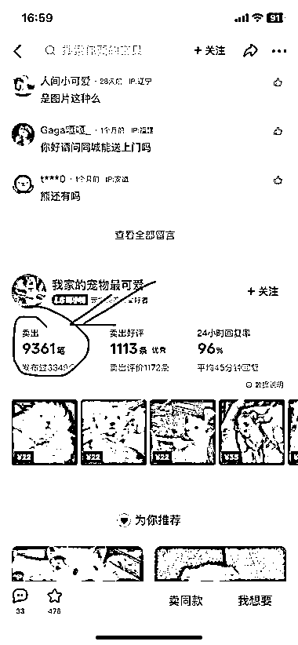
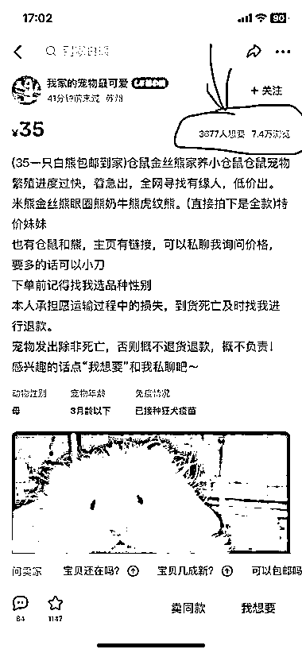
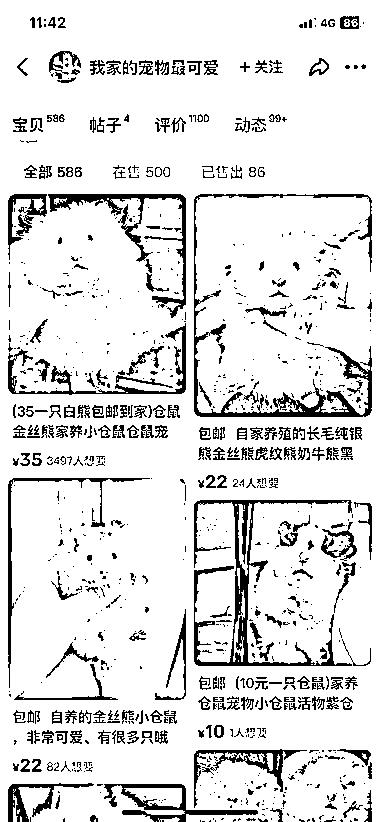
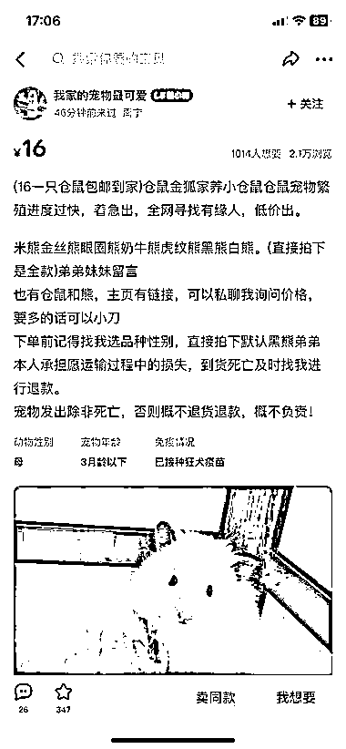

# 宠物类一直是闲鱼上的大热门领域，可以做长久的生意

> 原文：[`www.yuque.com/for_lazy/xkrm14/buy81rbidvbtpq0a`](https://www.yuque.com/for_lazy/xkrm14/buy81rbidvbtpq0a)

作者： Hai 陽

日期：2023-05-09

点赞数：60

正文：

宠物类一直是闲鱼上的大热门领域，猫咪、狗狗、乌龟、兔子、仓鼠等都卖得相当不错的，这个类目可以做长久的生意，属于做得越久越吃香的类型，新手小白都可以操作。 操作方法：一张好看的宠物实拍图片➕不同风格的文案➕低价引导咨询 下面这个账号上仓鼠垂直小类目，卖了将近一万单，闷声发大财~ 拓展思路：可以倒流到微信做二次变现，售卖宠物类笼子、主食、零食和周边用品，打持久战，你会发现客户积累越来越多，钱也赚得越来越多。

  

  

  

  

  

评论区：

lydia : 宠物活体货源好不好找～

Hai 陽 : 可以尝试当地的宠物市场寻找看看

Hai 陽 : 谢谢 支持😁

咔咔〖私人号〗 : 确实，活体一直都是蓝海，就是货源难搞特别是那种非常蓝海的

公众号懒人找资源，懒人专属群分享

