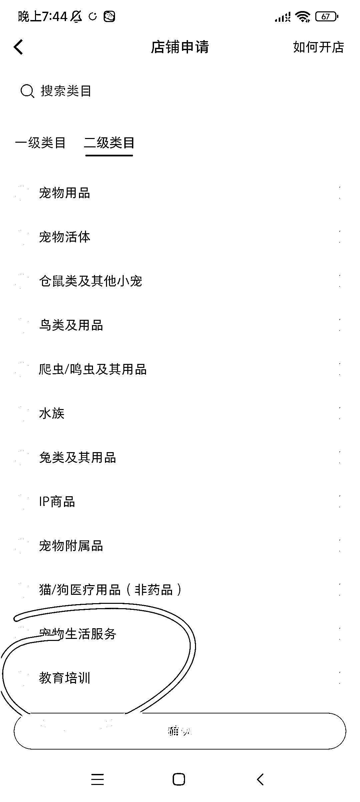
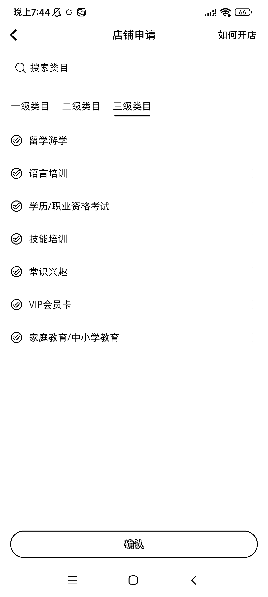
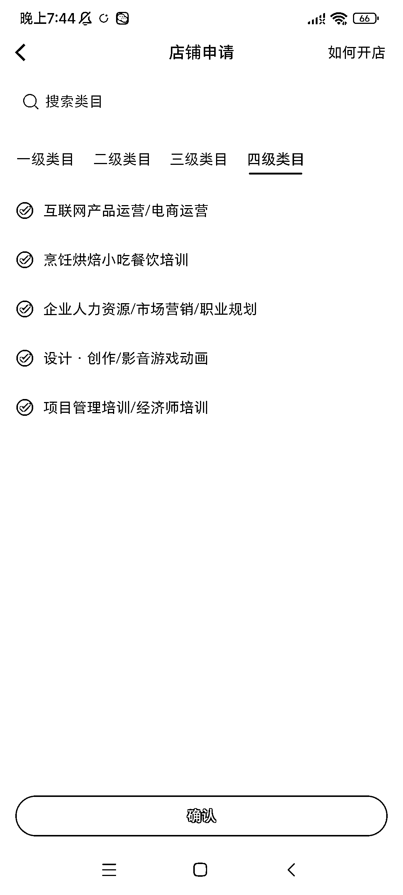

# 小红书可以上架课程、影视 VIP 会员卡，卖课程、卖影视会员卡了

> 原文：[`www.yuque.com/for_lazy/xkrm14/oczy5tholy16g1wt`](https://www.yuque.com/for_lazy/xkrm14/oczy5tholy16g1wt)

<ne-p id="udf892bab" data-lake-id="udf892bab"><ne-text id="u088fd597">作者： 阿黎</ne-text></ne-p> <ne-p id="uabb69dd7" data-lake-id="uabb69dd7"><ne-text id="u20bc3436">日期：2023-05-08</ne-text></ne-p> <ne-p id="u65bc6763" data-lake-id="u65bc6763"><ne-text id="uba76cc56">点赞数：</ne-text><ne-text id="u7249b880" ne-bold="true">82</ne-text></ne-p> <ne-hole id="u25e4a656" data-lake-id="u25e4a656"><ne-card data-card-name="hr" data-card-type="block" id="EqOFS" data-event-boundary="card"><ne-p id="u67e5ddc9" data-lake-id="u67e5ddc9"><ne-text id="ubdc09519">正文：</ne-text></ne-p> <ne-p id="uba72e296" data-lake-id="uba72e296"><ne-text id="u27843e2c">小红书可以上架课程、影视 VIP 会员卡，卖课程、卖影视会员卡了! 开通方法和类目（图 1—4） 在创作中心——更多服务——开通店铺</ne-text> <ne-text id="u3b3a79a6">一级类目:文化办公——二级类目:教育培训——后续还有 3 级和 4 级类目可选 部分类目需要上传资质（图 5） 玩法更多，5 月大航海的福利啊! 冲!</ne-text></ne-p> <ne-p id="ua3f506ac" data-lake-id="ua3f506ac"><ne-card data-card-name="image" data-card-type="inline" id="XryZx" data-event-boundary="card">  <ne-p id="ub87d0cc5" data-lake-id="ub87d0cc5"><ne-card data-card-name="image" data-card-type="inline" id="Fu7l6" data-event-boundary="card">  <ne-p id="u34726547" data-lake-id="u34726547"><ne-card data-card-name="image" data-card-type="inline" id="L4ftZ" data-event-boundary="card">  <ne-p id="ube8cd228" data-lake-id="ube8cd228"><ne-card data-card-name="image" data-card-type="inline" id="Jev5y" data-event-boundary="card">  <ne-p id="u4a69e249" data-lake-id="u4a69e249"><ne-card data-card-name="image" data-card-type="inline" id="EDOMR" data-event-boundary="card">  <ne-hole id="udae67c3a" data-lake-id="udae67c3a"><ne-card data-card-name="hr" data-card-type="block" id="VGCiE" data-event-boundary="card"><ne-p id="u536df7bb" data-lake-id="u536df7bb"><ne-text id="u0ef40942">评论区：</ne-text></ne-p> <ne-p id="u29f92578" data-lake-id="u29f92578"><ne-text id="uc16827ae">书虫¹ : 这个货源怎么搞呢，关于这个一直挺好奇的</ne-text></ne-p> <ne-p id="u76069162" data-lake-id="u76069162"><ne-text id="ub76d70f6">张小悦 : 我的还是不可以啊，请问您是有营业执照吗？</ne-text></ne-p> <ne-p id="u3e393233" data-lake-id="u3e393233"><ne-text id="u3beaa461">阿黎 : 参加大航海</ne-text></ne-p> <ne-p id="u155ddf6c" data-lake-id="u155ddf6c"><ne-text id="ue975a119">阿黎 : 不太明白，升级一下试试看，应该是大家都可以了</ne-text></ne-p> <ne-p id="u8d20fdf6" data-lake-id="u8d20fdf6"><ne-text id="uc1e40e0d">张小悦 : 我现在是小红书商家版最新的 APP 了，是苹果手机</ne-text></ne-p> <ne-p id="u5fa13d6f" data-lake-id="u5fa13d6f"><ne-text id="u6ffad105">张小悦 : 请问您开的小红书店铺是企业版还是个人版？</ne-text></ne-p> <ne-p id="u4bbcd225" data-lake-id="u4bbcd225"><ne-text id="u760026ae">阿党 : 个体工商户可以</ne-text></ne-p> <ne-hole id="ud2e1be45" data-lake-id="ud2e1be45"><ne-card data-card-name="hr" data-card-type="block" id="mMcc8" data-event-boundary="card"><ne-p id="u50e50d9a" data-lake-id="u50e50d9a"><ne-text id="u158cb64d">公众号懒人找资源，懒人专属群分享</ne-text></ne-p></ne-card></ne-hole></ne-card></ne-hole></ne-card></ne-p></ne-card></ne-p></ne-card></ne-p></ne-card></ne-p></ne-card></ne-p></ne-card></ne-hole>