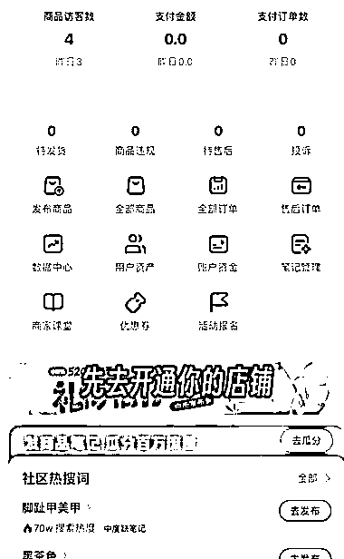
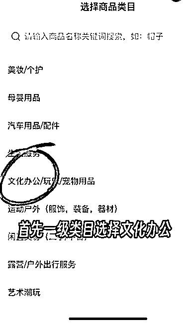
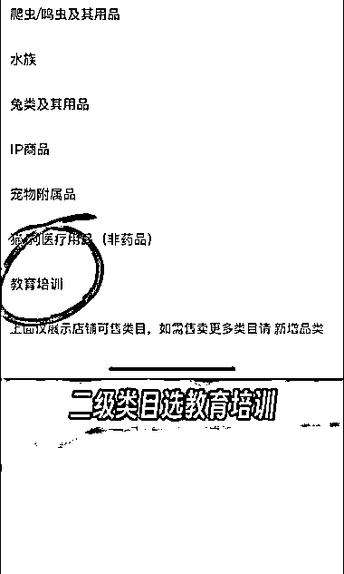
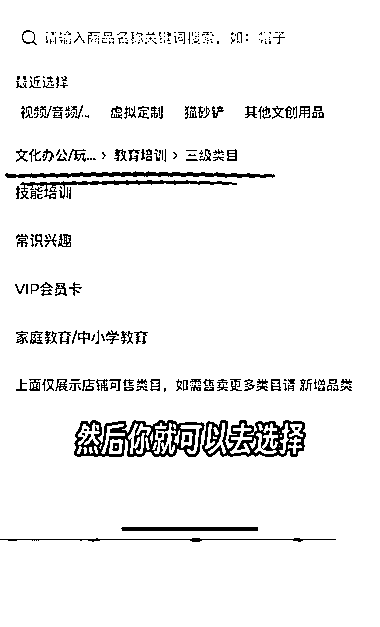

# 小红书卖课完整操作流程

> 原文：[`www.yuque.com/for_lazy/xkrm14/cix3ylmegbv896pr`](https://www.yuque.com/for_lazy/xkrm14/cix3ylmegbv896pr)

作者： Lumi

日期：2023-05-08

点赞数：84

正文：

小红书🉑以 卖课了 5 个步骤完成课程上架 完整操作流程见下图

评论区：

萧瑶 : 不错

圈圈元宝 : 这个 4 月份就可以卖了，但是有些课程会被投诉举报，亲身经历

Lumi : 有什么特别注意的吗，准备做这个领域

BLUE : 不错。有抖音的同类参考吗

公众号懒人找资源，懒人专属群分享

